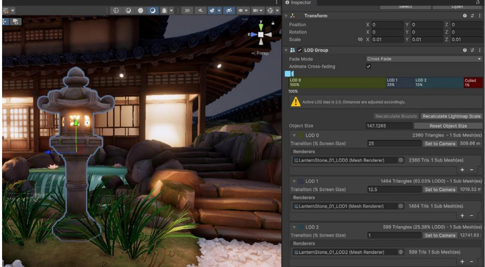
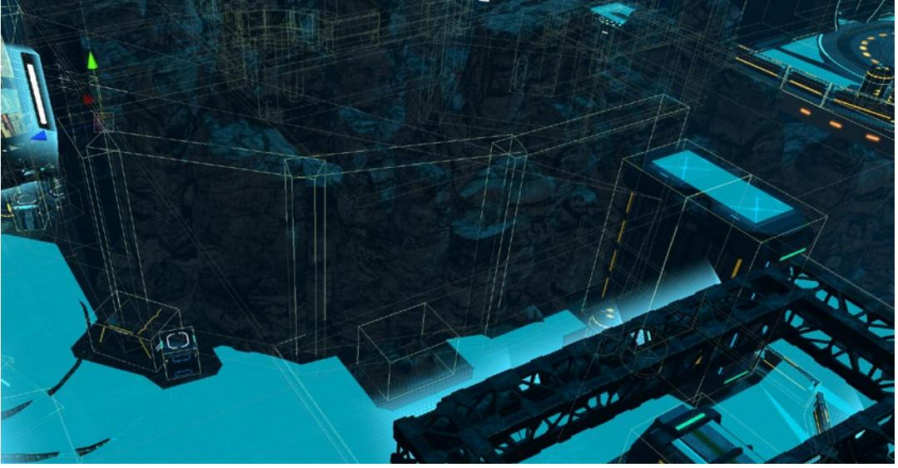

⟶ E-BOOK


# **Optimize your game performance for mobile, XR, and the web in Unity**


## **Contents**

| Introduction 8 |                                                                      |  |
|----------------|----------------------------------------------------------------------|--|
|                | Choose URP for performance and visual quality 9                      |  |
|                | Rendering optimization 10                                            |  |
|                | Profiling tips 11                                                    |  |
|                | Profile early, often, and on the target device 11                    |  |
|                | Focus on optimizing the right areas 12                               |  |
|                | Understand how the Unity Profiler works 14                           |  |
|                | Use the Profile Analyzer 18                                          |  |
|                | Work on a specific time budget per frame 18                          |  |
|                | Account for device temperature 19                                    |  |
|                | Determine if you are GPU-bound or CPU-bound 19                       |  |
|                | Test on both min-spec and max-spec devices 20                        |  |
|                | Memory management for XR, web, and mobile games 21                   |  |
|                | Efficient memory management 21                                       |  |
|                | Use the Memory Profiler 23                                           |  |
|                | Reduce the impact of garbage collection (GC) 23                      |  |
|                | Time garbage collection whenever possible 24                         |  |
|                | Use the Incremental Garbage Collector<br>to split the GC workload 24 |  |
|                | Adaptive Performance 25                                              |  |
|                | Assets 27                                                            |  |
|                | Import textures correctly 28                                         |  |
|                | Compress textures 29                                                 |  |
|                | Adjust mesh import settings 30                                       |  |
|                | Check your polygon counts 31                                         |  |

| Automate your import settings<br>using the AssetPostprocessor 31 |
|------------------------------------------------------------------|
| Unity DataTools 31                                               |
| Use the Addressable Asset System 32                              |
| Programming and code architecture 33                             |
| Understand the Unity PlayerLoop 34                               |
| Minimize code that runs every frame 35                           |
| Avoid heavy logic in Start/Awake 35                              |
| Avoid empty Unity events 36                                      |
| Remove Debug Log statements 36                                   |
| Use hash values instead of string parameters 37                  |
| Choose the right data structure 37                               |
| Avoid adding components at runtime 37                            |
| Cache GameObjects and components 37                              |
| Use object pools 38                                              |
| Use ScriptableObjects 39                                         |
| Project configuration 41                                         |
| Reduce or disable Accelerometer Frequency 41                     |
| Disable unnecessary Player or Quality settings 42                |
| Disable unnecessary physics 42                                   |
| Choose the right frame rate 42                                   |
| Avoid large hierarchies 42                                       |
| Transform once, not twice 43                                     |
| Vsync in XR, web, and mobile development 43                      |
| Vsync Count 44                                                   |
| Graphics and GPU optimization 45                                 |
| GPU optimization 47                                              |

| Benchmark the GPU 47                              |
|---------------------------------------------------|
| Watch the rendering statistics 48                 |
| Reduce Draw Calls 49                              |
| Use draw call batching 49                         |
| GPU Resident Drawer 51                            |
| Use the Frame Debugger 52                         |
| Split Graphics Jobs 53                            |
| Avoid too many dynamic lights 53                  |
| Disable shadows 54                                |
| Bake your lighting into lightmaps 54              |
| GPU light baking 55                               |
| Use Light Layers 56                               |
| Adaptive Probe Volumes 56                         |
| Use Level of Detail (LOD) 58                      |
| Use occlusion culling to remove hidden objects 59 |
| GPU occlusion culling 59                          |
| Avoid mobile native resolution 60                 |
| Limit use of cameras 60                           |
| Spatial-Temporal Post-Processing 60               |
| Shaders 62                                        |
| Keep shaders simple and optimized 62              |
| Minimize overdraw and alpha blending 63           |
| Limit post-processing effects 64                  |
| Be careful with Renderer.material 64              |
| Optimize SkinnedMeshRenderers 64                  |
| Minimize reflection probes 65                     |
| System Metrics Mali 65                            |

| User interface 67                                                |
|------------------------------------------------------------------|
| UGUI performance optimization tips 67                            |
| Divide your Canvases 67                                          |
| Hide invisible UI elements 68                                    |
| Limit GraphicRaycasters and disable Raycast Target 68            |
| Avoid Layout Groups 69                                           |
| Avoid large List and Grid views 69                               |
| Avoid numerous overlaid elements 69                              |
| Use multiple resolutions and aspect ratios  69                   |
| When using a fullscreen UI, hide everything else . 70            |
| Assign the Camera to World Space<br>and Camera Space Canvases 70 |
| UI Toolkit performance optimization tips 71                      |
| Use efficient layouts 71                                         |
| Avoid expensive operations in Update 71                          |
| Optimize event handling 72                                       |
| Optimize style sheets 72                                         |
| Profile and optimize 72                                          |
| Test on target platforms 72                                      |
| Audio 73                                                         |
| Make sound clips mono when possible 74                           |
| Use original uncompressed WAV files<br>as your source assets 74  |
| Compress the clip and reduce the compression bitrate 74          |
| Choose the proper Load Type 75                                   |
| Unload muted AudioSources from memory 75                         |
| Use the Sample Rate Setting 75                                   |

| Animation 76                                                      |  |
|-------------------------------------------------------------------|--|
| Use generic rather than humanoid rigs 76                          |  |
| Use alternatives for simple animation 77                          |  |
| Avoid scale curves 77                                             |  |
| Update only when visible 77                                       |  |
| Optimize workflow 77                                              |  |
| Separate animating hierarchies 78                                 |  |
| Minimize binding costs 78                                         |  |
| Avoid using component-based constraints on deep<br>hierarchies 78 |  |
| Consider performance implications<br>of animation rigging 78      |  |
| Physics 79                                                        |  |
| Simplify colliders 79                                             |  |
| Optimize your settings 80                                         |  |
| Adjust simulation frequency 80                                    |  |
| Modify CookingOptions for MeshColliders 82                        |  |
| Use Physics.BakeMesh 83                                           |  |
| Use Box Pruning for large scenes 84                               |  |
| Modify solver iterations 85                                       |  |
| Disable automatic transform syncing 86                            |  |
| Use Contact Arrays 87                                             |  |
| Reuse Collision Callbacks 87                                      |  |
| Move static colliders 88                                          |  |
| Use non-allocating queries 89                                     |  |
| Batch queries for ray casting 89                                  |  |
| Visualize with the Physics Debugger 90                            |  |

| Workflow and collaboration 90                       |
|-----------------------------------------------------|
| Unity Version Control 91                            |
| Break up large scenes 92                            |
| Remove unused resources 92                          |
| Platform-specific tips for Unity Web Builds 92      |
| Framerate 93                                        |
| Publishing settings for Unity Web 93                |
| Compression 93                                      |
| Strip engine code 94                                |
| Choose "None" in the Enable Exceptions setting . 95 |
| Target WebAssembly 2023 feature set 96              |
| Code Optimization settings 96                       |
| Profiling Unity Web Builds 96                       |
| Chrome DevTools 96                                  |
| XR optimization tips 97                             |
| Render Mode 97                                      |
| Foveated rendering 98                               |
| Utilize the XR Interaction Toolkit 99               |
| Performance testing for XR optimization 100         |
| Resources for advanced developers and artists 100   |

## <span id="page-7-0"></span>Introduction

This guide brings together all the best and latest mobile, XR, and Unity Web performance optimization tips for Unity 6. It is one of two optimization guides available, the other being *Optimize your game performance for consoles and PC in Unity*.

Optimizing your mobile, XR, or Unity Web application is an essential process that underpins the entire game development cycle. Hardware continues to evolve, and your game's optimization – along with its art, game design, audio, and monetization strategy – plays a key role in shaping the player experience.

Mobile, XR, and web games have active user bases reaching the billions. In the case of mobile, if your game is highly optimized, it has a better chance at passing certification from platformspecific stores. Aim for a performant application on the widest range of devices to maximize your opportunity for success at launch and beyond.

This e-book assembles knowledge and advice from Unity engineers who have partnered with developers across the industry to help them launch the best games possible.

Start optimizing with support from the Unity team. 1

<sup>1</sup> Note that many of the optimizations discussed here may introduce additional complexity, which can mean extra maintenance and potential bugs. Balance performance gains against the time and labor cost when implementing these best practices.

## <span id="page-8-0"></span>Choose URP for performance and visual quality

Unity recommends the [Universal Render Pipeline](https://docs.unity3d.com/6000.0/Documentation/Manual/urp/urp-introduction.html) (URP) for developing XR (extended reality), web, and mobile games and applications. URP is designed for high performance and scalability, offering efficient rendering that can adapt to a wide range of hardware. It enables you to achieve better visual quality while maintaining smooth performance, making it ideal for platforms where resource efficiency is crucial, such as WebGL and mobile devices. Additionally, URP allows for easier customization, ensuring your applications run optimally across diverse environments.


Choose URP as your render pipeline if you are developing a Unity mobile, XR, or web game.

<span id="page-9-0"></span>

In addition to selecting the URP you can adjust the render pipeline asset to further customize your settings.

## Rendering optimization

URP offers presets tailored for quality and performance. for tetherless VR experiences or AR apps on mobile devices. Selecting the appropriate render settings optimizes your application for mobile hardware, ensuring efficient rendering and smooth performance. The optimized settings of URP manage texture quality, shadow resolution, and lighting efficiently, providing a balance between visual fidelity and performance suitable for the constraints of mobile and tetherless XR devices.

| WHEN SHORT THE FORLER OF OR FURNER OF I                                | 【行动】【<br>0 |
|------------------------------------------------------------------------|------------|
| M. Or Januar Make I                                                    |            |
| 0.00                                                                   |            |
|                                                                        |            |
| Inspector<br>ロ<br>×<br>ក                                               |            |
| a !<br>@ Inspector                                                     |            |
| Mobila_Low (Universal Render Pipeline Asset)<br>01<br>0                |            |
| Open                                                                   |            |
| Rendering<br>1                                                         |            |
| Renderer List                                                          |            |
| 0 Mobile_Low_Renderer (Universal Renderer Data)<br>O Default.          |            |
| 1   Mobile_Low_ScreenRenderer (Universal Renderer Data)<br>Set Default |            |
| 2 Cockpit_Renderer (Universal Renderer Data)<br>6 Set Default          |            |
| + -                                                                    |            |
| ਤੇ<br>Depth Texture                                                    |            |
| Opaque Texture                                                         |            |
| Opaque Downsampong<br>2x Billnear                                      |            |
| Terrain Holes<br>GPU Resident Drawer<br>Disabled                       |            |
|                                                                        |            |
| Quality<br>HOR                                                         |            |
| Disabled<br>Anti Allesing (MSAA)                                       |            |
| 0.8<br>Render Scale                                                    |            |
| FidelityFX Super Resolution 1.0<br>Upscaling Fiter<br>8                |            |
| Override FSR Sharpness<br>LOD Cross Fade                               |            |
| Blue Nolse<br>LOD Cress Fade Ditthering Type                           |            |
| Lighting                                                               |            |
| Per Pixel<br>Main Light                                                |            |
| Cast Shadows<br>V                                                      |            |
| 512<br>Shadow Resolution                                               |            |
| Light Probe System<br>Light Probe Groups                               |            |
| Additional Lights<br>Per Pixel                                         |            |
| Per Object Limit<br>Cast Shadows                                       |            |
| Shadow Allies Resolution<br>2048                                       |            |
| Shedow Resolution Timm<br>Medium 512<br>Low 256<br>High 1024           |            |
| 512<br>Cookie Atlas Resolution                                         |            |
| Cookie Atlas Format<br>Grayscale Low                                   |            |
| Reflection Probes                                                      |            |
| Asset Labels                                                           |            |
|                                                                        |            |
| AssetBundle None<br>· None                                             |            |
|                                                                        |            |
| 8 1000 8                                                               |            |
|                                                                        |            |
|                                                                        |            |

Render pipeline asset

# <span id="page-10-1"></span><span id="page-10-0"></span>Profiling tips

## Profile early, often, and on the target device

Profiling is the process of measuring aspects of your game's performance at runtime and to track down the cause of a performance problem. By monitoring the profiling tool as you make changes, you can gauge whether changes actually fix the performance problem.


<span id="page-11-0"></span>

For mobile, XR, and web projects, it's crucial to profile your application early and throughout the development cycle, not just when you're nearing launch. Address performance issues such as glitches or spikes as soon as they appear, and benchmark performance before and after major changes. By developing a clear "performance profile" for your project, you can more easily identify and resolve new issues, ensuring optimal performance across all target platforms.

While profiling in the Editor can give you an idea of the relative performance of different systems in your game, profiling on each device gives you the opportunity to gain more accurate insights. Profile a development build on target devices whenever possible. Remember to profile and optimize for both the highest- and lowest-spec devices that you plan to support.

Unity offers a suite of profiling tools to help identify bottlenecks including

the [Unity Profiler,](https://docs.unity3d.com/6000.0/Documentation/Manual/Profiler.html?) the [Memory Profiler](https://docs.unity3d.com/Packages/com.unity.memoryprofiler@1.1/manual/index.html) and [Profile Analyzer](https://docs.unity3d.com/Packages/com.unity.performance.profile-analyzer@1.2/manual/index.html). There are also native tools from iOS and Android for further performance testing on their respective hardware:

- On iOS, use [Xcode](https://developer.apple.com/documentation/xcode/) and [Instruments](https://help.apple.com/instruments/mac/current/#/dev7b09c84f5).
- On Android / Arm use:
	- [Android Studio](https://developer.android.com/studio/profile): The latest Android Studio includes a new [Android Profiler](https://developer.android.com/studio/profile/android-profiler) that replaces the previous Android Monitor tools. Use it to gather real-time data about hardware resources on Android devices.
	- [Arm Mobile Studio:](https://developer.arm.com/tools-and-software/graphics-and-gaming/arm-mobile-studio) This suite of tools can help you profile and debug your games in great detail, catering toward devices running Arm hardware.
	- [Snapdragon Profiler](https://developer.qualcomm.com/software/snapdragon-profiler): Specifically for Snapdragon chipset devices only. Analyze CPU, GPU, DSP, memory, power, thermal, and network data to help find and fix performance bottlenecks.
	- [Developer tools for Meta Quest](https://developers.meta.com/horizon/resources/developer-tools/#performance-monitoring-and-profiling-tools): See Meta's developer tools website for information about developing apps for Meta Quest headsets.

Certain hardware can also take advantage of [Intel VTune,](https://software.intel.com/en-us/intel-vtune-amplifier-xe) which helps you to find and fix performance bottlenecks on Intel platforms (with Intel processors only).

### Focus on optimizing the right areas

Don't guess or make assumptions about what is slowing down your game's performance. Use the Unity Profiler and platform-specific tools to locate the precise source of a lag. Profiling tools ultimately help you understand what's going on under the hood of your Unity project, but don't wait for significant performance problems to start showing before digging into your detective toolbox.

Of course, not every optimization described here will apply to your application. Something that works well in one project may not translate to yours. Identify genuine bottlenecks and concentrate your efforts on what benefits your work. To learn more about how to plan your profiling workflows see the *[Ultimate guide to profiling Unity games](https://resources.unity.com/games/ultimate-guide-to-profiling-unity-games?ungated=true)*.


A chart from the profiling e-book featuring a workflow you can follow to profile your Unity projects efficiently

<span id="page-13-0"></span>

## Understand how the Unity Profiler works

The [Unity Profiler](https://docs.unity3d.com/6000.0/Documentation/Manual/Profiler.html) can help you detect the causes of any lags or freezes at runtime and better understand what's happening at a specific frame or point in time.

The Profiler is instrumentation-based; it profiles timings of game and engine code that are automatically marked up (such as MonoBehaviour's Start or Update methods, or specific API calls), or explicitly wrapped with the help of [ProfilerMarker](https://docs.unity3d.com/6000.0/Documentation/ScriptReference/Unity.Profiling.ProfilerMarker.html?) API.

Begin by enabling the CPU and Memory tracks as your default. You can monitor supplementary Profiler Modules like Renderer, Audio, and Physics, as needed for your game (e.g., physics-heavy or music-based gameplay).


Use the Unity Profiler to test performance and resource allocation for your application.

To capture profiling data from an actual mobile device within your chosen platform, check the **Development Build** and **Autoconnect Profiler** boxes before you click **Build and Run**. Alternatively, if you want the app to start separately from your profiling, you can uncheck the **Autoconnect Profiler** box, and then connect manually once the app is running.


Adjust your Build Settings before profiling.

Choose the platform target to profile. The **Record** button tracks several seconds of your application's playback (300 frames by default). Go to **Unity > Preferences > Analysis > Profiler > Frame Count** to increase this as far as 2000 if you need longer captures. While this means that the Unity Editor has to do more CPU work and take up more memory, it can be useful depending on your specific scenario.


Use the Timeline view to determine if you are CPU-bound or GPU-bound.

If you need in-depth analysis capturing detailed information about your application you can also use the [Deep Profiling](https://docs.unity3d.com/6000.0/Documentation/Manual/ProfilerWindow.html#deep-profiling) setting. This enables Unity to profile the beginning and end of every function call in your script code, telling you exactly which part of your application is being executed and potentially causing a delay. However, deep profiling adds overhead to every method call and may skew the performance analysis as it slows down the execution of your game during the profiling session.

Click in the window to analyze a specific frame. Next, use either the **Timeline** or **Hierarchy** view for the following:

- Timeline shows the visual breakdown of timing for a specific frame. This allows you to visualize how the activities relate to one another and across different threads. Use this option to determine if you are CPU- or GPU-bound:
	- If the CPU frame time is significantly higher than the GPU frame time, your game is CPU-bound. This means the CPU is taking longer to process the game logic, physics, or other calculations, and the GPU is waiting for the CPU to finish its tasks.
	- Similarly, if the GPU frame time is higher than the CPU frame time, your game is GPU-bound. This indicates that the GPU is taking longer to render graphics, and the CPU is waiting for the GPU to finish rendering.


— The Timeline Hierarchy shows the hierarchy of ProfileMarkers, grouped together. This allows you to sort the samples based on time cost in milliseconds (**Time ms** and S**elf ms**). You can also count the number of Calls to a function and the managed heap memory (GC Alloc) on the frame. By sorting by Time ms or Self ms, you can then identify the functions that are taking the most time, either on their own or due to the functions they call. This helps you focus your optimization efforts on the areas that will give the biggest performance gains.

| 0                                                                                              |                                                                                                          | Profiler                                 |                 |                |               |          |              |                                         |               |     |
|------------------------------------------------------------------------------------------------|----------------------------------------------------------------------------------------------------------|------------------------------------------|-----------------|----------------|---------------|----------|--------------|-----------------------------------------|---------------|-----|
| Co Profiler                                                                                    |                                                                                                          |                                          |                 |                |               |          |              |                                         |               |     |
| Profiler Modules<br>S. CPU Usage                                                               | - Playmode - @ 14 DI Frame: 145/300 Clear<br>66ms (15FPS)                                                | Clear on Play Deep Profile Call Stacks ▼ |                 |                |               |          |              | Selected: Gfx.WaitForPresentOnGfxThread | 0 2 2 0       |     |
| · Rendering                                                                                    |                                                                                                          |                                          |                 |                |               |          |              |                                         |               |     |
| · Scripts<br>· Physics                                                                         |                                                                                                          |                                          |                 |                |               |          |              |                                         |               |     |
| · Animation                                                                                    |                                                                                                          |                                          |                 |                |               |          |              |                                         |               |     |
| GarbageCollector<br>· VSync                                                                    | 33ms [30FPS                                                                                              |                                          |                 |                |               |          |              |                                         |               |     |
| · Global Illumination<br>u Ul                                                                  | 16ms (60FPS)                                                                                             |                                          |                 |                |               |          |              |                                         |               |     |
| Others                                                                                         |                                                                                                          |                                          |                 |                |               |          |              |                                         |               |     |
|                                                                                                |                                                                                                          | 1.17ms                                   |                 |                |               |          |              |                                         |               |     |
| C Memory                                                                                       |                                                                                                          | 368.6 MB<br>36.5 MB                      | 110.4 MB<br>164 |                |               |          |              |                                         |               |     |
| Total Used Memory<br>· Texture Memory                                                          |                                                                                                          | 11.22k                                   | 5.1 MB          |                |               |          |              |                                         |               |     |
| · Mesh Memory<br>· Material Count                                                              |                                                                                                          | 5,9 KB                                   |                 |                |               |          |              |                                         |               |     |
| Object Count<br>GC Used Memory                                                                 |                                                                                                          |                                          |                 |                |               |          |              |                                         |               |     |
| GC Allocated In Frame                                                                          |                                                                                                          |                                          |                 |                |               |          |              |                                         |               |     |
|                                                                                                |                                                                                                          |                                          |                 |                |               |          |              |                                         |               |     |
| Hierarchy                                                                                      | · Live Main Thread                                                                                       | CPU:36:30ms GPU :- - ms                  |                 | ರ              |               |          |              | No Detaills                             |               | 7 1 |
| Overview                                                                                       |                                                                                                          |                                          |                 | Total          | Self          | Calls    | GC Alloc     | Time ms                                 | Self ms       | A   |
| v PlayerLoop<br>> WaitForTargetFPS                                                             |                                                                                                          |                                          |                 | 99.9%<br>66.7% | 0.0%<br>66.7% | 1<br>13  | 5.9KB<br>0 B | 36.28<br>24.24                          | 0.02<br>24.23 |     |
| T PostLateUpdate.FinishFrameRendering                                                          |                                                                                                          |                                          |                 | 25.9%          | 0.1%          | 1        | 32 B         | 9,41                                    | 0.04          |     |
| - Gfx.WaitForPresentOnGlxThread                                                                | > RenderPipelineManager.DoRenderLoop_Internal()                                                          |                                          |                 | 22.0%<br>3.2%  | 0.0%<br>0.0%  | 13<br>12 | 328<br>08    | 8.00<br>1.17                            | 0.00<br>0.00  |     |
| > Destroy CullResults                                                                          |                                                                                                          |                                          |                 | 0.3%           | 0.0%          | 2        | OB           | 0.11                                    | 0.03          |     |
| > UlEvents.CanvasManagerRenderOverlays                                                         |                                                                                                          |                                          |                 | 0.1%           | 0.0%          | 12       | 0 8          | 0.04                                    | 0.00          |     |
|                                                                                                | TickReRuntimeRellectionSystemWapperInternal ScriptobleRunimeReflectionSystemMrapper_TickRealtimeProbes() |                                          |                 | 0.0%           | 0.0%          | 13       | OB           | 0.01                                    | 0.00          |     |
| > ReflectionProbes.Update                                                                      |                                                                                                          |                                          |                 | 0.0%<br>0.0%   | 0.0%          | 12<br>13 | OB<br>OB     | 0.01<br>0.01                            | 0.01<br>0.00  |     |
| > WatermarkRender<br>> UlEvents IMGUIRenderOverlays                                            |                                                                                                          |                                          |                 | 0.0%           | 0.0%<br>0.0%  | 13       | OB           | 0.00                                    | 0.00          |     |
|                                                                                                | SupportedRenderingFeatures.isUlOverlayRenderecBySRP()                                                    |                                          |                 | 0.0%           | 0.0%          | 17       | OB           | 0.00                                    | 0.00          |     |
| Camera Render                                                                                  |                                                                                                          |                                          |                 | 0.0%           | 0.0%          | 1        | 08           | 0.00                                    | 0.00          |     |
| End Graphics Jobs                                                                              |                                                                                                          |                                          |                 | 0.0%           | 0.0%          | 2        | OB           | 0.00                                    | 0.00          |     |
| > Update. ScriptRunBehaviourUpdate                                                             |                                                                                                          |                                          |                 | 1.3%           | 0.0%          | 17       | 5.3 KB       | 0.49                                    | 0.00          |     |
| FixedUpdate.PhysicsFixedUpdate<br>> PreLateUpdate.ScriptRunBehaviourLateUpdate                 |                                                                                                          |                                          |                 | 1.0%<br>0.9%   | 0.0%<br>0.0%  | 13<br>13 | OB<br>0.6KB  | 0.38<br>0.33                            | 0.01<br>0.00  |     |
| FixedUpdate.ScriptRunBehavlourFixedUpdate                                                      |                                                                                                          |                                          |                 | 0.8%           | 0.0%          | 1        | 08           | 0.31                                    | 0.00          |     |
| PostLateUpdate.Update.UpdateAllRenderers                                                       |                                                                                                          |                                          |                 | 0.7%           | 0.0%          | 1        | 08           | 0.25                                    | 0.00          |     |
| > PreLateUpdate.ParticleSystemBeginUpdateAll                                                   |                                                                                                          |                                          |                 | 0.4%           | 0.0%          | 16       | OB           | 0.16                                    | 0.00          |     |
| PostLateUpdate.ProfilerEndFrame                                                                |                                                                                                          |                                          |                 | 0.2%           | 0.0%          | 12       | OB           | 0.09                                    | 0.00          |     |
| I PostLateUpdate.UpdateAudio                                                                   |                                                                                                          |                                          |                 | 0.2%<br>0.1%   | 0.0%          | 13<br>11 | OB<br>OB     | 0.09<br>0.07                            | 0.00<br>0.00  |     |
| PostLateUpdate.ParticleSystemEndUpdateAll<br>> Early Update . Update Texture Streaming Manager |                                                                                                          |                                          |                 | 0.1%           | 0.0%<br>0.0%  | 1        | OB           | 0.04                                    | 0.00          |     |
| > FixedUpdate.AudioFixedUpdate                                                                 |                                                                                                          |                                          |                 | 0.1%           | 0.0%          | 13       | OB           | 0.04                                    | 0.00          |     |
| PreLateUpdate.AlUpdatePostScript                                                               |                                                                                                          |                                          |                 | 0.0%           | 0.0%          | 1.       | OB           | 0.03                                    | 0.00          |     |
| > PostLateUpdate.PlayerUpdateCanvases                                                          |                                                                                                          |                                          |                 | 0.0%           | 0.0%          |          | 0 8          | 0.02                                    | 0.00          |     |

The Hierarchy view allows you to sort ProfileMarkers by time cost.

You can find a complete overview of the Unity Profiler [here.](https://resources.unity.com/games/ultimate-guide-to-profiling-unity-games?ungated=true) If you're new to profiling, you can also watch this [Introduction to Unity Profiling.](https://youtube.com/watch?v=xjsqv8nj0cw)

Before optimizing anything in your project, save the Profiler .data file. Implement your changes and compare the saved .data before and after the modification. Rely on this cycle to improve performance: profile, optimize, and compare. Then, rinse and repeat.

<span id="page-17-0"></span>

## Use the Profile Analyzer

The Profile Analyzer lets you aggregate multiple frames of Profiler data and then locate frames of interest. Do you want to see what happens to the Profiler after you make a change to your project? The **Compare** view allows you to load and differentiate two data sets, so you can test changes and improve their outcome. The [Profile Analyzer](https://docs.unity3d.com/Packages/com.unity.performance.profile-analyzer@1.2/manual/index.html) is available via Unity's Package Manager. [Watch this Profile Analyzer tutorial](https://www.youtube.com/watch?v=Ypg84Fr20Sw&t=1s) to learn more about its features.

| Profile Analyzer                                                |                          |                      |               |                |              |                                        |                    |            |                              |                |             |        | : ロ× |
|-----------------------------------------------------------------|--------------------------|----------------------|---------------|----------------|--------------|----------------------------------------|--------------------|------------|------------------------------|----------------|-------------|--------|------|
| Mode: Single Compare Export Close Profiler Window               |                          |                      |               |                |              |                                        |                    |            |                              |                |             |        |      |
| Pull Data                                                       | 117.77ms ▼               |                      |               |                |              |                                        |                    |            | Frame Summary                |                |             |        |      |
| Load Save VikingVillage_Left_MacPlayer_Wind                     | 0.00ms                   | 33.00ms              |               |                |              |                                        |                    |            |                              | Left           | Right       | Diff   |      |
| Pull Data                                                       |                          |                      |               | 184 [262] 445  |              |                                        |                    | 999        | Frame Count                  | 262            | 262         | O      |      |
|                                                                 | 117.77ms ▼               | 33.00ms              |               |                |              |                                        |                    |            | Start                        | 184            | 184         |        |      |
| Load<br>Save VikingVillage_Right_MacPlayer_Win                  | 0.00ms                   |                      |               |                |              |                                        |                    | 999        | End                          | 445            | 445         |        |      |
|                                                                 | > a Pair Graph Selection |                      |               | 184 [262] 445  |              |                                        |                    | PlayerLoop |                              |                |             |        |      |
|                                                                 |                          |                      |               |                |              |                                        |                    |            |                              | ms             | ms          | ms     |      |
| v Filters                                                       |                          |                      |               |                |              |                                        |                    |            | Max                          | 22.91          | 16.10       | -6.80  |      |
| None<br>><br>Remove :                                           |                          |                      |               |                |              |                                        |                    |            | Upper Quartile               | 16.61          | 12.05       | -4.56  |      |
| All ▼<br>Name Filter :                                          |                          | Exclude Names: Any ▼ |               |                |              |                                        |                    |            | Median                       | 15.63          | 11.35       | -4.28  |      |
| Select Main Thread<br>Thread :                                  |                          |                      |               |                |              |                                        |                    |            | Mean                         | 15,90          | 11.60       | -4.30  |      |
| Depth Slice :<br>All - - - Auto Depth (Diff: None)              |                          |                      |               |                |              | Analysis Type : Total                  |                    |            | Lower Quartile               | 14.90          | 10.80       | -4.10  |      |
| Parent Marker :<br>Clear PlayerLoop                             |                          |                      |               |                |              | Units : Milliseconds                   |                    | >          | Min                          | 13.71          | 9.62        | -4.10  |      |
| 494 of 554 markers , 1 of 47 threads<br>Compare                 |                          |                      |               |                |              | Marker Columns : Time and Count        |                    | >          |                              |                |             | 22.905 |      |
|                                                                 |                          |                      |               |                |              |                                        |                    |            |                              |                |             |        |      |
| Top 10 markers on median frames                                 |                          |                      |               |                |              |                                        |                    |            |                              |                |             | 0      |      |
| 219<br>PlayerLoop<br>FinishFrameRe Render                       | GBuffer                  | Drawing Opaqı        |               |                |              |                                        |                    | 94.1ms     | O                            |                |             |        |      |
| FinishFrameR Render<br>292<br>PlayerLoop                        | GBuffer                  | Drawing Opaqı Cu     |               |                |              |                                        |                    | 65.0ms     | Thread Summary               |                |             |        |      |
| (All depths)                                                    |                          |                      |               |                |              |                                        | Ratio : Normalized |            |                              | Left           | Right       | Total  |      |
| Marker Comparison for currently selected range                  |                          |                      |               |                |              |                                        |                    |            | Total Count :                | 47             | 47          | 47     |      |
| Marker Name                                                     | Left Mer <               | 15                   | Right Mc Diff |                |              | Abs Diff   Count L   Count R   Count D |                    |            | Unique Count :               | O              | 0           | O      |      |
| PlayerLoop                                                      | 15.60                    |                      | 11,31         | -4.29          | 4.29         | 262                                    | 262                | 0          | Selected :                   | 1              |             | 1      |      |
| PostLateUpdate.FinishFrameRendering                             | 12.14                    |                      | 8.02          | -4.12          | 4.12         | 262                                    | 262                | 0          | Graph Scale :                | Upper quartile |             | >      |      |
| Camera. Render                                                  | 11,60                    |                      | 7.57          | -4.04          | 4.04         | 262                                    | 262                | 0          |                              | Median         | Thread      |        |      |
| RenderDeferred. GBuffer                                         | 9.76                     |                      | 5,78          | -3.98          | 3.98         | 524                                    | 524                | 0          |                              | -0 15.60       | Main Thread |        |      |
| Drawing                                                         | 7.85                     |                      | 4.80          | -3.05          | 3.05         | 524                                    | 524                | 0          | -11.31                       |                |             |        |      |
| Render. Opaque Geometry                                         | 6.06                     |                      | 3.65          | -2.41          | 2.41         | 524                                    | 524                | 0          |                              |                |             |        |      |
| BatchRenderer.Flush                                             | 1.41                     |                      | 0.61          | -0.80          | 0.80         | 45512                                  | 24812              | -20700     | Marker Summary<br>PlayerLoop |                |             |        |      |
| WaitForJobGroupID                                               | 2.02                     |                      | 1.23          | -0.79          | 0.79         | 3 අවශ්‍ය                               | 3622               | -377       | Mean frame contribution      |                |             |        |      |
| RenderForward.RenderLoopJob                                     | 0.94                     |                      | 0.38          | -0.56          | 0.56         | 524                                    | 524                | 0          |                              | Left           | Right       | Diff   |      |
| Culling                                                         | 2.49                     |                      | 1.93          | -0.56          | 0.56         | 524                                    | 524                | 0          |                              | 99.79%         | 99.65%      | -0.14% |      |
| Render. TransparentGeometry                                     | 0.98                     |                      | 0.48          | -0.50          | 0.50         | 524                                    | 524                | 0          | First frame                  | 184            | 184         |        |      |
| RenderForwardAlpha.Render                                       | 0.71                     |                      | 0.28          | -0.43          | 0.43         | 524                                    | 524                | 0          | Top 3 ▼ by frame costs       |                |             |        |      |
| Cull Results. Create Shared Renderer Scene                      | 1.01                     |                      | 0.66          | -0.35          | 0.35         | 524                                    | 524                | 0          |                              | 22.87          | 16.07       | -6.81  |      |
| SceneCulling                                                    | 1.34                     |                      | 1.05          | -0.28          | 0.28         | 524                                    | 524                | 0          |                              | 21.73          | 15.05       | -6.68  |      |
| CullSendEvents<br>Terrain Details Render                        | 1.22<br>0.85             |                      | 0.95<br>0:59  | -0.27<br>-0.25 | 0.27<br>0.25 | 524<br>262                             | 524<br>262         | 0<br>0     |                              | 20.64          | 14.87       | -5.76  |      |
| EndRenderQueueExtraction                                        | 0.78                     |                      | 0.54          | -0.25          | 0.25         | 524                                    | 524                | 0          |                              |                |             |        |      |
| ExecuteRenderQueueJob                                           | 0.36                     |                      | 0.14          | -0.21          | 0.21         | 319                                    | 301                | -18        |                              |                |             | 22.871 |      |
| Assembly-CSharp-firstpass.dll !:: Water Tile. On Will Ren< 0.99 |                          |                      | 0.79          | -0.20          | 0.20         | 262                                    | 262                | 0          |                              |                |             |        |      |
| Camera. Custom Render                                           | 0.90                     |                      | 0.71          | -0.20          | 0.20         | 262                                    | 262                | 0          |                              |                |             |        |      |
| Batch.DrawDynamic                                               | 0.21                     |                      | 0.06          | -0.15          | 0.15         | 9956                                   | 2620               | -7336      |                              |                |             |        |      |
| Render.Mesh                                                     | 0.27                     |                      | 0.13          | -0.14          | 0.14         | 112922                                 | 52924              | -59998     |                              |                |             | 9,5831 |      |
| RenderForwardOpaque.Render                                      | 0.30                     |                      | 0.17          | -0.13          | 0.13         | 262                                    | 262                | 0          | 9.5831                       | 22,871         |             |        |      |
| Flare.Render                                                    | 0.29                     |                      | 0.16          | -0.13          | 0.13         | 262                                    | 262                | 0          |                              |                |             |        |      |
| Queue Prepare Integrate Main Thread Objects                     | 0.19                     |                      | 0.07          | -0.13          | 0.13         | 524                                    | 524                | 0          |                              | ms             | ms          | ms     |      |
| Destroy CullResults                                             | 0.22                     |                      | 0.10          | -0.12          | 0.12         | 524                                    | 524                | 0          | Max                          | 22.87          | 16.07       | -6.81  |      |
| RenderLoop. CleanupNodeQueue                                    | 0.20                     |                      | 0.08          | -0.12          | 0.12         | 3668                                   | 3668               | 0          | Upper Quartile               | 16.57          | 12.00       | -4.57  |      |
| CullPerObjectLights                                             | 0.17                     |                      | 0.07          | -0.10          | 0.10         | 524                                    | 524                | 0          | Median                       | 15.60          | 11.31       | -4.29  |      |
| ComputeNeedsPerObjectLights                                     | 0.16                     |                      | 0.07          | -0.09          | 0.09         | 524                                    | 524                | 0          | Mean                         | 15.87          | 11.56       | -4.31  |      |
| Update. ScriptRunBehaviourUpdate                                | 0.44                     |                      | 0.35          | -0.08          | 0.08         | 262                                    | 262                | O          | Lower Quartile               | 14.87          | 10.77       | -4.11  |      |
| BehaviourUpdate                                                 | 0.43                     |                      | 0.35          | -0.08          | 0.08         | 262                                    | 262                | 0          | Min                          | 13.68          | 9.58        | -4.09  |      |
| ParticleSystem.Draw                                             | 0.09                     |                      | 0.03          | -0.07          | 0.07         | 6474                                   | 2280               | -4194      | Individual Max               | 22.87          | 16.07       | -6.81  |      |
| RenderDeferred.Lighting                                         | 0.14                     |                      | 0.07          | -0.06          | 0.06         | 262                                    | 262                | 0          | Individual Min               | 13.68          | 9.58        | -4.09  |      |
| Dandar Dransro                                                  | 019                      |                      | 000           | -0 00          | 000          | 601                                    | 62/                |            |                              |                |             |        |      |

Take an even deeper dive into frames and marker data with the Profile Analyzer, which complements the existing Profiler.

## Work on a specific time budget per frame

Each frame will have a time budget based on your target frames per second (fps). For an application to run at 30 fps, its frame budget can't exceed 33.33 ms per frame (1000 ms/30 fps). Likewise, a target of 60 fps leaves 16.66 ms per frame (1000 / 60 fps).

When developing virtual reality (VR) apps, maintaining a high and stable frame rate is even more critical to ensure a smooth and immersive experience, and to prevent motion sickness. The most common target for VR applications is 90 fps, which gives you a strict frame budget

<span id="page-18-0"></span>

of just 11.11 ms per frame (1000 ms / 90 fps). This higher requirement is necessary because VR needs to render each frame twice—once for each eye—and small imperfections in timing can be far more noticeable to the user.

A consistent and high frame rate is also essential for Unity Web Builds, the performance of which is highly dependent on the browser's efficiency and the hardware capabilities. A tight time budget per frame remains a critical factor. For example, if you're targeting 60 fps in a Unity WebGL build, you still have only 16.66 ms per frame to work with. This budget includes all aspects of rendering, physics calculations, and game logic, which means that optimizing every part of your application is crucial. Efficient management of assets, reducing the complexity of scenes, and optimizing shaders and scripts are all necessary steps to ensure that your application can meet its performance targets.

It's also important to consider the impact of WebAssembly (Wasm) performance, which Unity uses to compile and run your code in the browser. While Wasm offers significant performance improvements over traditional JavaScript, it's still important to profile and optimize your code to ensure that you're making the most of the available frame time.

### Account for device temperature

For mobile, however, it's generally not recommended to use this maximum time consistently as the device can overheat and the OS can thermal throttle the CPU and GPU. A general rule of thumb is use only about 65% of the available time to allow for cooldown between frames. A typical frame budget will be approximately 22 ms per frame at 30 fps and 11 ms per frame at 60 fps.

Devices can exceed this budget for short periods of time (e.g., for cutscenes or loading sequences) but not for a prolonged duration.

Most mobile devices do not have active cooling like their desktop counterparts. Physical heat levels can directly impact performance.

If the device is running hot, the Profiler might perceive and report poor performance, even if it is not cause for long-term concern. To combat profiling overheating, profile in short bursts. This cools the device and simulates real-world conditions. Our general recommendation is to keep the device cool for 10-15 minutes before profiling again.

## Determine if you are GPU-bound or CPU-bound

The central processing unit (CPU) is responsible for determining what must be drawn, and the graphics processing unit (GPU) is responsible for drawing it. When a rendering performance problem is due to the CPU taking too long to render a frame, the game becomes CPU bound. When a rendering performance problem is due to the GPU taking too long to render a frame, it becomes GPU bound.

<span id="page-19-0"></span>

The Profiler can tell you if your CPU is taking longer than your allotted frame budget, or if the culprit is your GPU. It does this by emitting markers prefixed with Gfx as follows:

- If you see the **Gfx.WaitForCommands** marker, it means that the render thread is ready, but you might be waiting for a bottleneck on the main thread.
- If you frequently encounter **Gfx.WaitForPresent**, it means that the main thread is ready but might be waiting for the GPU to present the frame.

## Test on both min-spec and max-spec devices

There is a wide range of iOS and Android devices out there. We want to reiterate the importance of testing your project on the minimum and maximum device specifications that you want your application to support, whenever possible.

## <span id="page-20-0"></span>Memory management for XR, web, and mobile games

Effective memory management is crucial for ensuring smooth performance. Unity handles automatic memory management for your scripts and user-generated code, allocating small, transient data on the stack and larger, long-term data on managed or native heaps. However, the demands of XR, web, and mobile applications require a more careful approach to memory usage, as inefficient memory management can lead to performance issues such as slow frame rates, increased load times, and even application crashes. In this section, we'll explore strategies to optimize memory usage across these platforms, helping you deliver responsive and stable applications.

## Efficient memory management

To deliver smooth and responsive experiences across platforms, it's essential to carefully manage object lifecycles, minimize garbage collection overhead, and optimize asset loading strategies.

**Manage object lifecycles**: Properly manage the creation and destruction of objects to prevent memory leaks and unnecessary resource usage. Use **Destroy()** to remove unused objects and set references to null when they are no longer needed, which can free up memory.

**Object pooling**: Reuse frequently used objects, such as bullets, enemies, and UI elements, rather than creating and destroying them repeatedly. Implementing object pools can significantly reduce the overhead associated with object instantiation and destruction and save on memory resources. Read more about [object pooling in a Unity project.](https://unity.com/how-to/use-object-pooling-boost-performance-c-scripts-unity)


**Reduce garbage collection impact:** Minimize allocations to reduce the frequency and impact of garbage collection, which can cause performance hitches. Avoid frequent allocations in update loops by preallocating arrays and lists where possible. Use value types (structs) instead of reference types (classes) when appropriate, as structs are allocated on the stack and do not contribute to garbage collection overhead.

Optimize asset loading with the following techniques:

- **Lazy loading**: Defer the loading of resources until they are actually needed. This can facilitate faster initial load times and more efficient resource management.
- **Unload unused assets**: Use Resources.UnloadUnusedAssets(), to free up memory occupied by assets that are no longer needed.
- **Use the Addressable Asset System**: Utilize the Addressable Asset System to manage assets asynchronously at runtime. This system is particularly beneficial for web and mobile platforms, supporting remote asset hosting, dynamic content updates, and lazy loading.

The garbage collector periodically identifies and deallocates unused managed heap memory. The asset garbage collection runs on demand or when you load a new scene and deallocates native objects and resources. While this runs automatically, the process of examining all the objects in the heap can cause the game to stutter or run slowly.

Optimizing your memory usage means being conscious of when you allocate and deallocate heap memory, and how you minimize the effect of garbage collection.


See [Understanding the managed heap](https://docs.unity3d.com/6000.0/Documentation/Manual/performance-memory-overview.html) for more information.

Capture, inspect, and compare snapshots in the Memory Profiler.

<span id="page-22-0"></span>

## Use the Memory Profiler

The [Memory Profiler package](https://docs.unity3d.com/Packages/com.unity.memoryprofiler@1.1/manual/index.html) takes a snapshot of your managed heap memory to help you identify problems like fragmentation and memory leaks. For a quick introduction check out this Unity [video here](https://www.youtube.com/watch?v=Uuzd39AjFWQ&t).

Use the **Unity Objects** tab to identify areas where you can eliminate duplicate memory entries or find which objects use the most memory. The **All of Memory** tab displays a breakdown of all the memory in the snapshot that Unity tracks.

Learn how to leverage the [Memory Profiler in Unity](https://docs.unity3d.com/Packages/com.unity.memoryprofiler@latest) for improved memory usage.

## Reduce the impact of garbage collection (GC)

Unity uses the [Boehm-Demers-Weiser garbage collector](https://www.hboehm.info/gc/), which stops running your program code and only resumes normal execution once its work is complete.

Be aware of certain unnecessary heap allocations that can cause GC spikes:

- **Strings**: In C#, strings are reference types, not value types. Reduce unnecessary string creation or manipulation if you are using them at large scale. Avoid parsing stringbased data files such as JSON and XML; store data in ScriptableObjects or formats like MessagePack or Protobuf instead. Use the [StringBuilder](https://msdn.microsoft.com/en-us/library/system.text.stringbuilder) class if you need to build strings at runtime.
- **Unity function calls**: Some functions create heap allocations. Cache references to arrays rather than allocating them in the middle of a loop. Also, take advantage of certain functions that avoid generating garbage. For example, use GameObject.CompareTag instead of manually comparing a string with GameObject.tag (as returning a new string creates garbage).
- **Boxing**: Avoid passing a value-typed variable in place of a reference-typed variable. This creates a temporary object, and the potential garbage that comes with it implicitly converts the value type to a type object (e.g., int i = 123; object o = i). Instead, try to provide concrete overrides with the value type you want to pass in. Generics can also be used for these overrides.
- **Coroutines**: Though yield does not produce garbage, creating a new WaitForSeconds object does. Cache and reuse the WaitForSeconds object rather than creating it in the yield line.
- **LINQ and Regular Expressions**: Both of these generate garbage from behind-thescenes boxing. Avoid LINQ and Regular Expressions if performance is an issue. Write for loops and use lists as an alternative to creating new arrays.

For more information, see the manual page on [Garbage collection best practices.](https://docs.unity3d.com/6000.0/Documentation/Manual/performance-garbage-collection-best-practices.html)

<span id="page-23-0"></span>

## Time garbage collection whenever possible

If you are certain that a garbage collection freeze won't affect a specific point in your game, you can trigger garbage collection with **System.GC.Collect**.

See [Understanding automatic memory management](https://docs.unity3d.com/6000.0/Documentation/Manual/performance-garbage-collector.html) for examples of how to use this to your advantage.

### Use the Incremental Garbage Collector to split the GC workload

Rather than creating a single, long interruption during your program's execution, incremental garbage collection uses multiple, much shorter interruptions that distribute the workload over many frames. If garbage collection is impacting performance, try enabling this option to see if it can reduce the problem of GC spikes. Use the Profile Analyzer to verify its benefit to your application.

Use the Incremental Garbage Collector to reduce GC spikes.

# <span id="page-24-0"></span>Adaptive Performance

With Unity and Samsung's [Adaptive Performance](https://developer.samsung.com/galaxy-gamedev/ap-userguide/v2.html), you can monitor the device's thermal and power state to ensure that you are ready to react appropriately. When users play for an extended period of time, you can reduce your level of detail (LOD) bias dynamically so that your game continues to run smoothly. Adaptive Performance allows developers to increase performance in a controlled way while maintaining graphics fidelity.

While you can use Adaptive Performance APIs to fine-tune your application, Adaptive Performance also offers several automatic modes. In these modes, Adaptive Performance determines the game settings along several key metrics:

- Desired frame rate based on previous frames
- Device temperature level
- Device proximity to thermal event
- Device bound by CPU or GPU

These four metrics dictate the state of the device, and Adaptive Performance tweaks the adjusted settings to reduce the bottleneck. This is done by providing an integer value, known as an Indexer, to describe the state of the device.

To learn more about Adaptive Performance, you can view the[samples](https://docs.unity3d.com/Packages/com.unity.adaptiveperformance@5.0/manual/samples-guide.html) we've provided in the Package Manager by selecting **Package Manager > Adaptive Performance > Samples**. Each sample interacts with a specific scaler, so you can see how the different scalers impact your game. We also recommend reviewing the [end-user documentation](https://docs.unity3d.com/Packages/com.unity.adaptiveperformance@5.0/manual/index.html) to learn more about Adaptive Performance configurations and how you can interact directly with the API.


Note that Adaptive Performance only works for Samsung devices.


The Adaptive Performance package


## <span id="page-26-0"></span>Assets

A well-optimized asset pipeline can speed up load times, reduce memory usage, and improve runtime performance. By working with an experienced technical artist, your team can define and enforce asset formats, specifications, and import settings to ensure an efficient and streamlined workflow.

Don't rely solely on default settings. Take advantage of the platform-specific override tab to optimize assets like textures, mesh geometry, and audio files. Incorrect settings can result in larger build sizes, longer build times, and poor memory usage.

Consider using **[Presets](https://docs.unity3d.com/6000.0/Documentation/Manual/Presets.html)** to establish baseline settings tailored to your specific project needs. This proactive approach helps ensure that assets are optimized from the start, leading to better performance and a more consistent experience across all platforms.

For more guidance, refer to the [best practices for art assets](https://docs.unity3d.com/Manual/HOWTO-ArtAssetBestPracticeGuide.html?utm_source=demand-gen&utm_medium=pdf&utm_campaign=asset-links-gmg-elevate-your-game&utm_content=optimize-mobile-game-performance-ebook) or explore the [3D Art Optimization](https://learn.unity.com/course/3d-art-optimization-for-mobile-gaming-5474?utm_source=demand-gen&utm_medium=pdf&utm_campaign=clean-code&utm_content=mobile-performance-optimization-ebook) [for Mobile Applications](https://learn.unity.com/course/3d-art-optimization-for-mobile-gaming-5474?utm_source=demand-gen&utm_medium=pdf&utm_campaign=clean-code&utm_content=mobile-performance-optimization-ebook) course on Unity Learn. These resources provide valuable insights that can help you make informed decisions about asset optimization for Unity web builds, mobile, and XR applications.

<span id="page-27-0"></span>

## Import textures correctly

Import settings are crucial because textures often consume the most memory. Consider the following guidelines to optimize your textures:

- **Lower the Max Size**: Use the minimum settings that produce visually acceptable results. This is non-destructive and can quickly reduce your texture memory.
- **Use powers of two (POT)**: Unity requires POT texture dimensions for mobile texture compression formats (PVRCT or ETC).

| C Inspector                           |                                                                   | 3                |
|---------------------------------------|-------------------------------------------------------------------|------------------|
|                                       |                                                                   | Open             |
| Texture Type                          | Default                                                           |                  |
| Texture Shape                         | 2D                                                                |                  |
| SRGB (Color Texture)                  | >                                                                 |                  |
| Alpha Source                          | Input Texture Alpha                                               | 4                |
| Alpha Is Transparency                 | 0                                                                 |                  |
| P Advanced                            |                                                                   |                  |
| Non-Power of 2                        | ToNearest                                                         |                  |
| Read/Write                            |                                                                   |                  |
| Virtual Texture Only                  |                                                                   |                  |
| Generate Mipmap                       | V                                                                 |                  |
| T Generation Settings                 |                                                                   |                  |
| Mipmap Filtering<br>Preserve Coverage | Box                                                               | >                |
| Replicate Border                      |                                                                   |                  |
| Fadeout to Gray                       |                                                                   |                  |
| Mipmap Limit                          | >                                                                 |                  |
| Mipmap Limit Group                    | None (Use Global Mipmap Limit)                                    | D                |
| Stream Mipmap Levels                  |                                                                   |                  |
| Ignore PNG Gamma                      |                                                                   |                  |
| Swizzle                               | R<br>. G<br>B                                                     | - A              |
| Wrap Mode                             | Repeat                                                            | -                |
| Filter Mode                           | Billnear                                                          |                  |
| Aniso Level                           | -- @                                                              |                  |
| Default<br>0                          | C                                                                 | 0                |
| J Override For IOS                    |                                                                   |                  |
| Max Size                              | 2048                                                              | A                |
| Resize Algorithm<br>Format            | Mitchell<br>RGB(A) Compressed ASTC 8x8 block                      | D                |
| Compressor Quality                    | Normal                                                            | A                |
|                                       |                                                                   |                  |
|                                       |                                                                   | Revert Apply     |
| Asset PostProcessors                  |                                                                   |                  |
| WoodPlank_01_T_A                      | RGB<br>R<br>G                                                     | B<br>C<br>@ 95 : |
|                                       |                                                                   |                  |
|                                       | WoodPlank_01_T_A<br>1024x1024 RGB Compressed DXT1 BC1 sRGB 0.7 MB |                  |
|                                       |                                                                   | 4                |
| AssetBundle<br>None                   |                                                                   | 4<br>~ None      |
|                                       |                                                                   |                  |
|                                       |                                                                   |                  |
|                                       |                                                                   |                  |

Proper texture import settings will help optimize your build size.

- **Atlas your textures**: Atlasing is the process of grouping together several smaller textures into a single larger texture of uniform size. Placing multiple textures into a single texture can reduce draw calls and speed up rendering. Use the [Unity Sprite Atlas](https://docs.unity3d.com/6000.0/Documentation/Manual/class-SpriteAtlas.html?) or the third-party [TexturePacker](https://www.codeandweb.com/texturepacker) to atlas your textures.
- **Toggle off the Read/Write Enabled option**: When enabled, this option creates a copy in both CPU- and GPUaddressable memory, doubling the texture's memory footprint. In most cases, keep this disabled. If you are generating textures at runtime, enforce this via **Texture2D.Apply**, passing in **makeNoLongerReadable** set to **true**.
- **Disable unnecessary mipmaps**: While mipmaps can optimize performance by reducing the amount of detail that needs to be rendered at different distances from the camera, they aren't always needed. For textures that remain at a consistent size onscreen, such as 2D sprites and UI graphics you can leave them out (leave mipmaps enabled for 3D models with varying distance from the camera).

<span id="page-28-0"></span>

## Compress textures

Consider these two examples using the same model and texture. The settings on the left consume almost 26 times the memory as those on the right, without much improvement in visual quality.


Uncompressed textures require more memory.

Use Adaptive Scalable Texture Compression (ATSC) for mobile, XR and Web. The vast majority of games in development tend to target min-spec devices that support ATSC compression.

The only exceptions are:

- iOS games targeting A7 devices or lower (e.g., iPhone 5, 5S, etc.) use PVRTC
- Android games targeting devices prior to 2016 use ETC2 (Ericsson Texture Compression)

If compressed formats such as PVRTC and ETC aren't sufficiently high-quality, and if ASTC is not fully supported on your target platform, try using 16-bit textures instead of 32-bit textures.

See the manual for more information on [recommended texture compression format by](https://docs.unity3d.com/6000.0/Documentation/Manual/class-TextureImporterOverride.html)  [platform](https://docs.unity3d.com/6000.0/Documentation/Manual/class-TextureImporterOverride.html).

<span id="page-29-0"></span>

Selecting ASTC for texture compression under the build settings

### Adjust mesh import settings

Just like textures, meshes can consume significant memory, so choose optimal import settings for them. Reduce the memory footprint of meshes with the following practices:

- **Compress the mesh:** Aggressive compression can reduce disk space (memory at runtime, however, is unaffected). Note that mesh quantization can result in inaccuracies, so experiment with compression levels to see what works for your models.
- **Disable Read/Write:** Enabling this option duplicates the mesh in memory, which keeps one copy of the mesh in system memory and another in GPU memory. In most cases, you should disable it (in Unity 2019.2 and earlier, this option is checked by default).
- **Disable rigs and blend shapes:** If your mesh does not need skeletal or blendshape animation, disable these options wherever possible.
- **Disable normals and tangents:** If you are absolutely certain that the mesh material will not need normals or tangents, uncheck these options for extra savings.

<span id="page-30-0"></span>

Check your mesh import settings.

## Check your polygon counts

Higher-resolution models mean more memory usage and potentially longer GPU times. Does your background geometry need half a million polygons? Consider cutting down models in your DCC package of choice. Delete unseen polygons from the camera's point of view, and use textures and normal maps for fine detail instead of high-density meshes.

### Automate your import settings using the AssetPostprocessor

The [AssetPostprocessor](https://docs.unity3d.com/6000.0/Documentation/ScriptReference/AssetPostprocessor.html?) allows you to hook into the import pipeline and run scripts prior to or when importing assets. This prompts you to customize settings before and/or after importing models, textures, audio, and so on in a way similar to presets but through code. Learn more about the process in our GDC 2023 talk, "[Technical tips for every stage of game creation](https://youtu.be/o_QBMz0WZjI?list=PLX2vGYjWbI0TkxPwhWgsBhvj-EwxJDt5x&t=816)."

## Unity DataTools

[Unity DataTools](https://github.com/Unity-Technologies/UnityDataTools) is a collection of open source tools provided by Unity that aims to enhance data management and serialization capabilities in Unity projects. It includes features for analyzing and optimizing project data, such as identifying unused assets, detecting asset dependencies, and reducing build size.

<span id="page-31-0"></span>

## Use the Addressable Asset System

The [Addressable Asset System](https://docs.unity3d.com/Packages/com.unity.addressables@2.3/manual/index.html) provides a simplified way to manage your content. This unified system loads AssetBundles by "address" or alias, asynchronously from either a local path or a remote content delivery network (CDN).


If you split your non-code assets (models, textures, Prefabs, audio, and even entire scenes) into an [AssetBundle,](https://docs.unity3d.com/6000.0/Documentation/Manual/AssetBundlesIntro.html?) you can separate them as downloadable content (DLC).

Then, use Addressables to create a smaller initial build for your mobile application. [Cloud](https://unity.com/products/cloud-content-delivery)  [Content Delivery](https://unity.com/products/cloud-content-delivery) lets you host and deliver your game content to players as they progress through the game.

| Addressables Groups                                                                                              |                                                                                                                                                                                                                                                                                                                                                                                  |                            |                            | X ■ × |
|------------------------------------------------------------------------------------------------------------------|----------------------------------------------------------------------------------------------------------------------------------------------------------------------------------------------------------------------------------------------------------------------------------------------------------------------------------------------------------------------------------|----------------------------|----------------------------|-------|
| Create · Profile: Default · Tools ·                                                                              |                                                                                                                                                                                                                                                                                                                                                                                  | Play Mode Script ▼ Build ▼ | Q.                         | ×     |
| Group Name \ Addressable Name<br>Built In Data<br>Utility (Default)                                              | Path                                                                                                                                                                                                                                                                                                                                                                             |                            | Labels                     |       |
| camera<br>checkpoint<br>volume_manager<br>Boats                                                                  | 6<br>Assets/Objects/misc/Main Camera.prefab<br>0<br>Assets/Objects/misc/checkpoint.prefab<br>0<br>Assets/Objects/misc/DefaultVolume.prefab                                                                                                                                                                                                                                       |                            | ><br>A<br>D                |       |
| boat_interceptor                                                                                                 | 20<br>Assets/Objects/boats/Interceptor/_Interceptor.prefab                                                                                                                                                                                                                                                                                                                       |                            | >                          |       |
| boat_renegade<br>boat effect wake                                                                                | 0<br>Assets/Objects/boats/renegade/_Renegade.prefab<br>0<br>Assets/Objects/misc/Wake.prefab                                                                                                                                                                                                                                                                                      |                            | ><br>>                     |       |
| v UI                                                                                                             |                                                                                                                                                                                                                                                                                                                                                                                  |                            |                            |       |
| ui race<br>ui_loading_screen<br>ui_player_marker<br>ui_racestats_player<br>ui_race_touch<br>ui_player_map_marker | 0<br>Assets/Objects/Ul/prefabs/InGame/Race_Canvas.prefab<br>6<br>Assets/Objects/Ul/prefabs/LoadingScreen.prefab<br>0<br>Assets/Objects/Ul/prefabs/InGame/PlayerMarker.prefab<br>8<br>Assets/Objects/Ul/prefabs/InGame/RaceStats_Player.prefab<br>20<br>Assets/Objects/Ul/prefabs/InGame/Race_Canvas_touch.prefab<br>6<br>Assets/Objects/Ul/prefabs/InGame/PlayerMapMarker.prefab |                            | D<br>A<br>><br>V<br>><br>D |       |
| VolumeProfiles                                                                                                   |                                                                                                                                                                                                                                                                                                                                                                                  |                            |                            |       |
| vol_quality_low<br>vol_quality_medium<br>vol_quality_base<br>vol_quality_high                                    | 8<br>Assets/Data/Volumes/LowQuality.asset<br>8<br>Assets/Data/Volumes/MediumQuality.asset<br>જુન<br>Assets/Data/Volumes/BaseEffects.asset<br>8<br>Assets/Data/Volumes/HighQuality.asset                                                                                                                                                                                          |                            | ><br>D<br>><br>A           |       |

Load assets by "address" using the Addressable Asset System.

Click [here](https://unity.com/how-to/simplify-your-content-management-addressables?) to see how the Addressable Asset System can take the hassle out of asset management.

## <span id="page-32-0"></span>Programming and code architecture

The Unity [PlayerLoop](https://docs.unity3d.com/6000.0/Documentation/ScriptReference/LowLevel.PlayerLoop.html) contains functions for interacting with the core of the game engine. This structure includes a number of systems that handle initialization and per-frame updates. All of your scripts will rely on this PlayerLoop to create gameplay.

When profiling, you'll see your project's user code under the PlayerLoop (with Editor components under the EditorLoop).


The Profiler will show your custom scripts, settings, and graphics in the context of the entire engine's execution.

Optimize your scripts with the following tips and tricks.

<span id="page-33-0"></span>

## Understand the Unity PlayerLoop

Make sure you understand the [execution order](https://docs.unity3d.com/6000.0/Documentation/Manual/ExecutionOrder.html?) of Unity's frame loop. Every Unity script runs several event functions in a predetermined order. You should understand the difference between **Awake**, **Start**, **Update**, and other functions that create the lifecycle of a script. You can utilize the Low-Level API to add custom logic to the player's update loop.


Get to know the PlayerLoop and the lifecycle of a script.

<span id="page-34-0"></span>

## Minimize code that runs every frame

Consider whether code must run every frame. Move unnecessary logic out of **Update**, **LateUpdate**, and **FixedUpdate**. These event functions are convenient places to put code that must update every frame, while extracting any logic that does not need to update with that frequency. Whenever possible, only execute logic when things change.

If you *do* need to use **Update**, consider running the code every *n* frames. This is one way to apply time slicing, a common technique of distributing a heavy workload across multiple frames. In this example, we run the **ExampleExpensiveFunction** once every three frames:

```
private int interval = 3;
void Update()
{
 if (Time.frameCount % interval == 0)
 {
 ExampleExpensiveFunction();
 }
}
```
Better yet, if **ExampleExpensiveFunction** performs some operation on a set of data, consider using time slicing to operate on a different subset of that data every frame. By doing 1/n of the work every frame rather than all of the work every n frames, you end up with performance that is more stable and predictable overall, rather than seeing periodic CPU spikes.

### Avoid heavy logic in Start/Awake

When your first scene loads, these functions get called for each object:

- **Awake**
- **OnEnable/OnDisable**
- **Start**

Avoid expensive logic in these functions until your application renders its first frame. Otherwise, you might encounter longer loading times than necessary.

Refer to the [order of execution for event functions](https://docs.unity3d.com/6000.0/Documentation/Manual/ExecutionOrder.html?) for more details.

<span id="page-35-0"></span>

## Avoid empty Unity events

Even empty MonoBehaviours require resources, so you should remove blank **Update** or **LateUpdate** methods.

Use preprocessor directives if you are employing these methods for testing:

```
#if UNITY_EDITOR
void Update()
{
}
#endif
```
Here, you can freely use the **Update** in-Editor for testing without unnecessary overhead slipping into your build.

## Remove Debug Log statements

Log statements (especially in **Update**, **LateUpdate**, or **FixedUpdate**) can bog down performance. Disable your **Log** statements before making a build.

To do this more easily, consider making a [Conditional attribute](https://docs.microsoft.com/en-us/dotnet/api/system.diagnostics.conditionalattribute?view=net-5.0) along with a preprocessing directive. For example, create a custom class like this:


| Script Compilation       |                           |
|--------------------------|---------------------------|
| Scripting Define Symbols |                           |
| URP                      |                           |
| USE_CUSTOM_METADATA      |                           |
| ENABLE_LOG               |                           |
|                          |                           |
|                          | Copy Defines Revert Apply |

Adding a custom preprocessor directive lets you partition your scripts.

<span id="page-36-0"></span>

Generate your log message with your custom class. If you disable the **ENABLE\_LOG**  preprocessor in the **Player Settings**, all of your **Log** statements disappear in one fell swoop.

The same thing applies for other use cases of the Debug Class, such as Debug.DrawLine and Debug.DrawRay. These are also only intended for use during development and can significantly impact performance.

## Use hash values instead of string parameters

Unity does not use string names to address animator, material, and shader properties internally. For speed, all property names are hashed into property IDs, and these IDs are actually used to address the properties.

When using a Set or Get method on an animator, material, or shader, harness the integervalued method instead of the string-valued methods. The string methods simply perform string hashing and then forward the hashed ID to the integer-valued methods.

Use [Animator.StringToHash](https://docs.unity3d.com/6000.0/Documentation/ScriptReference/Animator.StringToHash.html?) for Animator property names and [Shader.PropertyToID](https://docs.unity3d.com/6000.0/Documentation/ScriptReference/Shader.PropertyToID.html?) for material and shader property names. Get these hashes during initialization and cache them in variables for when they're needed to pass to a Get or Set method.

## Choose the right data structure

Your choice of data structure impacts efficiency as you iterate thousands of times per frame. Not sure whether to use a List, Array, or Dictionary for your collection? Follow the [MSDN guide](https://msdn.microsoft.com/en-us/library/7y3x785f)  [to data structures](https://msdn.microsoft.com/en-us/library/7y3x785f) in C# as a general guide for choosing the correct structure.

### Avoid adding components at runtime

Invoking **AddComponent** at runtime comes with some cost. Unity must check for duplicate or other required components whenever adding components at runtime.

[Instantiating a prefab](https://docs.unity3d.com/6000.0/Documentation/Manual/Prefabs.html) with the desired components already set up is generally more performant.

## Cache GameObjects and components

It's best to cache references in either Awake or Start in order to avoid calling them in the Update method..

Here's an example that demonstrates the inefficient use of a repeated **GetComponent** call:

```
void Update()
{
 Renderer myRenderer = GetComponent<Renderer>();
 ExampleFunction(myRenderer);
}
```
<span id="page-37-0"></span>

It's more efficient to invoke **GetComponent** only once, as the result of the function is cached. The cached result can be reused in **Update** without any further calls to **GetComponent**.

```
private Renderer myRenderer;
void Start()
{
 myRenderer = GetComponent<Renderer>();
}
void Update()
{
 ExampleFunction(myRenderer);
}
```
In Unity versions prior to Unity 2020.2 **GameObject.Find**, **GameObject.GetComponent**, and **Camera.main** used to be very expensive, however this is no longer the case. That said, it's best to avoid calling them in **Update** methods and follow the practice above by caching the results.

## Use object pools

**Instantiate** and **Destroy** can generate garbage and garbage collection (GC) spikes, which generally results in a slow process. Apply object pooling techniques when you need to instantiate a large number of objects.


In this example, the ObjectPool creates 20 PlayerLaser instances for reuse.

A best practice for object pooling is to create the reusable instances when a CPU spike is less noticeable (e.g., during a menu screen). Then track this "pool" of objects with a collection. During gameplay, enable the next available instance when needed, disable objects instead of destroying them, and return them to the pool.

<span id="page-38-0"></span>


An example of a pool of projectile objects that's inactive and ready to shoot.

This reduces the number of managed allocations in your project and can prevent garbage collection problems. Unity includes a built-in object pooling feature via the [UnityEngine.Pool](https://docs.unity3d.com/6000.0/Documentation/ScriptReference/Pool.ObjectPool_1.html)  namespace. Available in Unity 2021 LTS and later, this namespace facilitates the management of object pools, automating aspects like object lifecycle and pool size control.

Learn how to create a simple object pooling system in Unity [here](https://learn.unity.com/tutorial/introduction-to-object-pooling). You can also see the object pooling pattern, and many others, implemented in a Unity scene [in this sample project](https://assetstore.unity.com/packages/essentials/tutorial-projects/level-up-your-code-with-design-patterns-and-solid-289616)  [available on the Unity Asset Store.](https://assetstore.unity.com/packages/essentials/tutorial-projects/level-up-your-code-with-design-patterns-and-solid-289616)

## Use ScriptableObjects

Store static values or settings in a **ScriptableObject** instead of a MonoBehaviour. The ScriptableObject is an asset that lives inside of the project that you only need to set up once.

MonoBehaviours carry extra overhead since they require a GameObject – and by default a Transform – to act as a host. That means you need to create a lot of unused data before storing a single value. The ScriptableObject slims down this memory footprint by dropping the GameObject and Transform. It also stores the data at the project level, which is helpful if you need to access the same data from multiple scenes.


A common use case is having many GameObjects that rely on the same duplicate data that does not need to change at runtime. Rather than having this duplicate local data on each GameObject, you can funnel it into a ScriptableObject. Then, each of the objects stores a reference to the shared data asset, rather than copying the data itself. This can provide significant performance improvements in projects with thousands of objects.

Create fields in the ScriptableObject to store your values or settings, then reference the ScriptableObject in your MonoBehaviours.


In this example, a ScriptableObject called Inventory holds settings for various GameObjects.

Using those fields from the ScriptableObject can prevent unnecessary duplication of data every time you instantiate an object with that MonoBehaviour.

In software design, this is an optimization known as the flyweight pattern. Restructuring your code in this way using ScriptableObjects avoids copying a lot of values and reduces your memory footprint. Learn more about the flyweight pattern and many others, as well as design principles, in the e-book *[Level up your code with design patterns and SOLID](https://unity.com/resources/design-patterns-solid-ebook?isGated=alse)*.

Watch this [Introduction to ScriptableObjects](https://youtu.be/WLDgtRNK2VE) devlog to see how ScriptableObjects can benefit your project. Reference Unity documentation [here](https://docs.unity3d.com/Manual/class-ScriptableObject.html) as well as the technical guide *[Create](https://resources.unity.com/games/create-modular-game-architecture-with-scriptable-objects-ebook?ungated=true)  [modular game architecture in Unity with ScriptableObjects](https://resources.unity.com/games/create-modular-game-architecture-with-scriptable-objects-ebook?ungated=true)*.

# <span id="page-40-0"></span>Project configuration

There are a few Project Settings that can affect your mobile performance.

## Reduce or disable Accelerometer Frequency

Unity pools your mobile's accelerometer several times per second. Disable this if it's not being used in your application, or reduce its frequency for better overall performance.

| 9 Project Settings                                                                                                                                                                                                                                                                                                                                                                                                                            |                                                                                                                                                                                                                                                                                                                                                                                                                                                                                                                                                                                                                                                                                                                               |                                                                                                                                                                                                                                                                                                        | 0<br>×                |
|-----------------------------------------------------------------------------------------------------------------------------------------------------------------------------------------------------------------------------------------------------------------------------------------------------------------------------------------------------------------------------------------------------------------------------------------------|-------------------------------------------------------------------------------------------------------------------------------------------------------------------------------------------------------------------------------------------------------------------------------------------------------------------------------------------------------------------------------------------------------------------------------------------------------------------------------------------------------------------------------------------------------------------------------------------------------------------------------------------------------------------------------------------------------------------------------|--------------------------------------------------------------------------------------------------------------------------------------------------------------------------------------------------------------------------------------------------------------------------------------------------------|-----------------------|
| Project Settings                                                                                                                                                                                                                                                                                                                                                                                                                              |                                                                                                                                                                                                                                                                                                                                                                                                                                                                                                                                                                                                                                                                                                                               | ರ                                                                                                                                                                                                                                                                                                      |                       |
| Adaptive Performance<br>Audio                                                                                                                                                                                                                                                                                                                                                                                                                 | Player                                                                                                                                                                                                                                                                                                                                                                                                                                                                                                                                                                                                                                                                                                                        |                                                                                                                                                                                                                                                                                                        | 0 2                   |
| Burst AOT Settings<br>Editor<br>Graphics<br>Input Manager<br>Input System Package<br>Settings<br>Memory Settings<br>Package Manager<br>Physics<br>Settings<br>Physics 2D<br>Player<br>Preset Manager<br>Quality<br>Scene Template<br>Script Execution Order<br>Services<br>ShaderGraph<br>Tags and Layers<br>TextMesh Pro<br>Settings<br>Time<br>Timeline<br>UI Toolkit<br>Version Control<br>VEX<br>Visual Scripting<br>XR Plugin Management | Automatically Sign<br>iOS Provisioning Profile<br>Profile ID:<br>Profile Type:<br>Configuration<br>Scripting Backend<br>Api Compatibility Level®<br>Editor Assemblies Compatibility Level®<br>IL2CPP Code Generation<br>C++ Compiler Configuration<br>IL2CPP Stacktrace Information<br>Use incremental GC<br>Allow downloads over HTTP*<br>Camera Usage Description®<br>Microphone Usage Description®<br>Location Usage Description*<br>Use on-demand resources®<br>Accelerometer Frequency®<br>Mute Other Audio Sources®<br>Prepare iOS for Recording<br>Audio input from Bluetooth microphones<br>Force IOS Speakers when Recording<br>Requires Persistent WiFi®<br>> Supported URL schemes*<br>Target Device<br>Target SDK | E<br>Automatic<br>IL2CPP<br>.NET Standard 2.1<br>Default (.NET Framework)<br>Fastor runtimo<br>Release<br>Method Name<br>><br>Not allowed<br>Disabled<br>Disabled<br>15 Hz<br>30 Hz<br>ter Audio Sources and Prepare IOS for Recording are both off.<br>60 Hz<br>100 Hz<br>IPhone + IPad<br>Device SDK | Browse<br>V<br>V<br>0 |

Ensure your Accelerometer Frequency is disabled if you are not making use of it in your mobile game.

<span id="page-41-0"></span>

## Disable unnecessary Player or Quality settings

In the **Player** settings, disable **Auto Graphics API** for unsupported platforms to prevent generating excessive shader variants. Disable **Target Architectures** for older CPUs if your application is not supporting them.

In the **Quality** settings, disable needless Quality levels.

## Disable unnecessary physics

If your game is not using physics, uncheck **Auto Simulation** and **Auto Sync Transforms**. These will just slow down your application with no discernible benefit.

## Choose the right frame rate

Mobile projects must balance frame rates against battery life and thermal throttling. Instead of pushing the limits of your device at 60 fps, consider running at 30 fps as a compromise. Unity defaults to 30 fps for mobile.

When targeting XR platforms, the frame rate considerations are even more critical. A frame rate of 72 fps, 90 fps, or even 120 fps, is often necessary to maintain immersion and prevent motion sickness. These higher frame rates help ensure a smooth and responsive experience, which is crucial for comfort in VR environments. However, these come with their own challenges in terms of power consumption and thermal management, particularly in standalone VR headsets.

Choosing the right frame rate is about understanding the specific demands and constraints of your target platform, whether it's a mobile device, a standalone VR headset, or an AR device. By carefully selecting an appropriate frame rate, you can optimize both performance and user experience across different platforms.

You can also adjust the frame rate dynamically during runtime with **Application. targetFrameRate**. For example, you could drop below 30 fps for slow or relatively static scenes and reserve higher fps settings for gameplay.

## Avoid large hierarchies

Split your hierarchies. If your GameObjects do not need to be nested in a hierarchy, simplify the parenting. Smaller hierarchies benefit from multithreading to refresh the Transforms in your scene. Complex hierarchies incur unnecessary Transform computations and more cost to garbage collection.

<span id="page-42-0"></span>

## Transform once, not twice

Additionally, when moving Transforms, use [Transform.SetPositionAndRotation](https://docs.unity3d.com/6000.0/Documentation/ScriptReference/Transform.SetPositionAndRotation.html?) to update both position and rotation at once. This avoids the overhead of modifying a transform twice.

If you need to [instantiate](https://docs.unity3d.com/6000.0/Documentation/ScriptReference/Object.Instantiate.html) a GameObject at runtime, a simple optimization is to parent and reposition during instantiation:

**GameObject.Instantiate(prefab, parent); GameObject.Instantiate(prefab, parent, position, rotation);**

For more on Object.Instantiate, please see the [Scripting API.](https://docs.unity3d.com/6000.0/Documentation/ScriptReference/Object.Instantiate.html)

#### **Vsync in XR, web, and mobile development**

When developing for XR, web, and mobile platforms, assume that Vsync (Vertical Synchronization) is enabled, even if you disable it in the Unity Editor (Project Settings > Quality). Vsync is often enforced at the hardware level on these platforms to prevent screen tearing and ensure smooth visual output. If the GPU cannot render a frame quickly enough to match the display's refresh rate, the current frame will be held and displayed again, effectively reducing your fps. Let's look at how this works per platform.

- Mobile Platforms: Mobile devices typically enforce Vsync to match the display's refresh rate, often at 60Hz or higher on newer devices. If your application's frame rate drops below this target, the device will hold the previous frame, causing noticeable stuttering or input lag. It's crucial to optimize rendering performance to maintain a steady frame rate, ensuring smooth operation across a variety of mobile devices with different performance capabilities.
- Web Platforms: Web browsers also tend to enforce Vsync, particularly in Unity Web, to ensure synchronization with the display's refresh rate. Given the additional overhead of running within a browser, optimizing your application to maintain a consistent frame rate is essential to avoid visible performance drops. Test across different browsers and devices as web platforms can vary in their capabilities.
- XR Platforms: In XR environments, maintaining a high and stable frame rate is even more critical due to the immersive nature of these experiences. Most XR devices enforce Vsync at 90Hz or higher, and any drop in frame rate can lead to discomfort or motion sickness for users. Optimizing every aspect of your application, from rendering to physics calculations, is essential to ensure the GPU can consistently meet these high demands.

By understanding how Vsync is managed across XR, web, and mobile platforms, and by optimizing your application to maintain a consistent frame rate, you can deliver smoother, more responsive experiences that meet the expectations of users on these diverse platforms.

<span id="page-43-0"></span>

#### **Vsync Count**

The **Vsync Count** setting in Unity's Quality settings determines how the rendering of frames is synchronized with the display's refresh rate. When set to **Every V Blank** (equivalent to a Vsync Count of 1), Unity synchronizes the rendering of frames with each vertical blank, effectively capping the frame rate to match the display's refresh rate (e.g., 60Hz = 60 FPS). This helps prevent screen tearing and ensures smooth visual output.

Alternatively, setting it to **Every Second V Blank** (Vsync Count of 2) halves the frame rate, which might be useful in situations where your application struggles to maintain full refresh rate performance. Disabling Vsync (Don't Sync) allows for maximum FPS but can result in screen tearing. On some platforms, Vsync may still be enforced at the hardware level regardless of this setting.


VSync count within the Quality settings

## <span id="page-44-0"></span>Graphics and GPU optimization

With each frame, Unity determines the objects that must be rendered and then creates draw calls. A draw call is a call to the graphics API to draw objects (e.g., a triangle), whereas a batch is a group of draw calls to be executed together.

As your projects become more complex, you'll need a pipeline that optimizes the workload on your GPU. The **[Universal Render Pipeline \(URP\)](https://docs.unity3d.com/Packages/com.unity.render-pipelines.universal@17.0/manual/index.html)** supports three options for rendering: Forward, Forward+, and Deferred.

Forward rendering evaluates all lighting in a single pass and is generally recommended as default for mobile games. Forward+, introduced with Unity 2022 LTS, improves upon standard Forward rendering by culling lights spatially rather than per object. This significantly increases the overall number of lights that can be utilized in rendering a frame. Deferred mode is a good choice for specific cases, such as for games with lots of dynamic light sources. The same physically based lighting and materials from consoles and PCs can also scale to your phone or tablet.


The following table compares the three rendering options in URP.

| Feature                                                | Forward                                       | Forward+                                      | Deferred                                                                                                                                                             |  |
|--------------------------------------------------------|-----------------------------------------------|-----------------------------------------------|----------------------------------------------------------------------------------------------------------------------------------------------------------------------|--|
| Maximum<br>number of real<br>time lights per<br>object | 9                                             | Unlimited; the<br>per-Camera limit<br>applies | Unlimited                                                                                                                                                            |  |
|                                                        |                                               |                                               | Two options:                                                                                                                                                         |  |
| Per pixel normal<br>encoding                           | No encoding<br>(accurate<br>normal<br>values) |                                               | Quantization of normals in G-buffer (loss of<br>accuracy, better performance)                                                                                        |  |
|                                                        |                                               | No encoding<br>(accurate normal<br>values)    | Octahedron encoding (accurate normals,<br>might have significant performance impact<br>on mobile GPUs)                                                               |  |
|                                                        |                                               |                                               | For more information, see Encoding of<br>normals in G-buffer.                                                                                                        |  |
| MSAA                                                   | Yes                                           | Yes                                           | No                                                                                                                                                                   |  |
| Vertex lighting                                        | Yes                                           | No                                            | No                                                                                                                                                                   |  |
| Camera<br>stacking                                     | Yes                                           | Yes                                           | Supported with a limitation: Unity renders<br>only the base Camera using the Deferred<br>path; Unity renders all overlay Cameras<br>using the Forward Rendering path |  |

Learn more about using URP in Unity projects in the e-book *[Introduction to the Universal](https://unity.com/resources/introduction-to-urp-advanced-creators-unity-6)  [Render Pipeline for advanced Unity creators](https://unity.com/resources/introduction-to-urp-advanced-creators-unity-6)*.

# <span id="page-46-0"></span>GPU optimization

To optimize your graphics rendering, it's essential to understand the limitations of your target hardware – whether it's VR, mobile, or web – and how to effectively profile the GPU. Profiling allows you to check and verify that your optimizations are having the desired impact.

- **VR**: VR hardware demands high frame rates (typically 90 FPS or higher) and low latency to maintain a smooth and immersive experience. The GPU needs to render complex scenes twice (once for each eye), which requires careful optimization of both performance and visual fidelity.
- **Mobile**: Mobile devices have limited processing power and memory compared to desktops and consoles. Optimizations should focus on minimizing draw calls, reducing texture sizes, and using simplified shaders to ensure smooth performance without draining the battery or overheating the device.
- **Web**: Web platforms, particularly when using Unity Web, must balance performance with the constraints of running in a browser environment. Optimization should prioritize reducing build size, minimizing load times, and ensuring compatibility across different browsers and hardware configurations.

Use these best practices for reducing the rendering workload on the GPU.

## Benchmark the GPU

When profiling, it's useful to start with a benchmark. A benchmark tells you what profiling results you should expect from specific GPUs.

<span id="page-47-0"></span>

See [GFXBench](https://gfxbench.com/result.jsp) for a great list of different industry-standard benchmarks for GPUs and graphics cards. The website provides a good overview of the current GPUs available and how they stack up against each other.

## Watch the rendering statistics

Click the **Stats** button in the top right of the Game view. This window shows you real-time rendering information about your application during Play mode. Use this data to help optimize performance:

- **fps**: Frames per second
- **CPU Main:** Total time to process one frame (and update the Editor for all windows)
- **CPU Render thread:** Total time to render one frame of the Game view
- **Batches:** Groups of draw calls to be drawn together
- **Tris (triangles) and Verts (vertices):** Mesh geometry complexity
- **SetPass calls:** The number of times Unity must switch shader passes to render the GameObjects onscreen; each pass can introduce extra CPU overhead.

Note: In-Editor fps does not necessarily translate to build performance. We recommend that you profile your build for the most accurate results. Frame time in milliseconds is a [more accurate metric than frames per second](http://www.mvps.org/directx/articles/fps_versus_frame_time.htm) when benchmarking.


Stats window displaying real-time rendering info

<span id="page-48-0"></span>

## Reduce Draw Calls

When rendering a GameObject, it issues a draw call to the graphics API (e.g., OpenGL, Vulkan, or Direct3D). Each draw call is resource-intensive, as the CPU must prepare and send the necessary data to the GPU, which then processes the command to render the object. Frequent state changes between draw calls, such as switching materials, can further increase CPU overhead.

While PC and console hardware can handle a large number of draw calls, the overhead remains significant enough to justify optimization. On mobile devices, VR headsets, and web browsers, draw call optimization is crucial for maintaining performance. By reducing the number of draw calls, you can ensure smoother and more efficient rendering, especially on resource-constrained platforms.

To optimize performance, especially on web, VR, and mobile platforms, reducing draw calls is essential. Here are key strategies to achieve this:

- 1. **Use a texture atlas**: Combine multiple textures into a single texture atlas to minimize the number of texture bindings and draw calls. This is particularly important in web and mobile environments where reducing state changes can improve rendering efficiency.
- 2. **Optimize materials**: Limit the number of materials and shaders used in your project. Shared materials are easier to batch together and reduce the draw call overhead.
- 3. **Implement LOD (Level of Detail)**: Use LOD techniques to decrease the complexity of distant objects, reducing the number of draw calls for objects that are far from the camera. This approach is vital for VR, where maintaining high frame rates is critical to prevent motion sickness, and for mobile platforms, where processing power is limited.
- 4. **Apply culling techniques**: Use frustum culling and occlusion culling to ensure that only visible objects are rendered. By not drawing objects that are outside the camera's view or obscured by other geometry, you can reduce the number of draw calls, improving performance across all platforms, especially in resource-constrained web and mobile environments.

#### **Use draw call batching**

[Draw call batching](https://docs.unity3d.com/6000.0/Documentation/Manual/DrawCallBatching.html?) is an optimization method that combines meshes so that Unity can render them in fewer draw calls.

Draw call batching minimizes these state changes and reduces the CPU cost of rendering objects. Unity can combine multiple objects into fewer batches using several techniques:

— **SRP Batching:** If you are using HDRP or URP, enable the [SRP Batcher](https://blog.unity.com/engine-platform/srp-batcher-speed-up-your-rendering) in your Pipeline Asset settings under **Advanced**. When using compatible shaders, the SRP Batcher reduces the GPU setup between draw calls and makes material data persistent in GPU Memory. This can speed up your CPU rendering times significantly. Use fewer [Shader](https://docs.unity3d.com/6000.0/Documentation/Manual/SL-MultipleProgramVariants.html?)  [Variants](https://docs.unity3d.com/6000.0/Documentation/Manual/SL-MultipleProgramVariants.html?) with a minimal amount of Keywords to improve SRP batching. Consult [this SRP](https://docs.unity3d.com/6000.0/Documentation/Manual/SRPBatcher.html)  [documentation](https://docs.unity3d.com/6000.0/Documentation/Manual/SRPBatcher.html) to see how your project can take advantage of this rendering workflow.

| C Inspector                                           |          | a |  |  |
|-------------------------------------------------------|----------|---|--|--|
| Pipeline Asset_High (Universal Render Pipeline Asset) |          |   |  |  |
|                                                       |          |   |  |  |
| Addressable                                           |          |   |  |  |
| General                                               |          |   |  |  |
| Quality<br>A                                          |          |   |  |  |
| Lighting<br>A                                         |          |   |  |  |
| Shadows                                               |          |   |  |  |
| Post-processing                                       |          |   |  |  |
| Advanced                                              |          |   |  |  |
| SRP Batcher                                           | V        |   |  |  |
| Dynamic Batching                                      |          |   |  |  |
| Mixed Lighting                                        | >        |   |  |  |
| Debug Level                                           | Disabled | D |  |  |
| Shader Variant Log Level                              | Disabled | D |  |  |

SRP Batcher helps you batch draw calls.

- **GPU instancing:** If you have a large number of identical objects (e.g., buildings, trees, grass, and so on with the same mesh and material), use [GPU instancing.](https://docs.unity3d.com/6000.0/Documentation/Manual/GPUInstancing.html) This technique batches them using graphics hardware. To enable GPU Instancing, select your material in the Project window, and in the Inspector, check **Enable Instancing**.
- **Static batching:** For non-moving geometry, Unity can reduce draw calls for any meshes sharing the same material. It is more efficient than dynamic batching, but it uses more memory.

Mark all meshes that never move as **Batching Static** in the Inspector. Unity combines all static meshes into one large mesh at build time. The [StaticBatchingUtility](https://docs.unity3d.com/6000.0/Documentation/ScriptReference/StaticBatchingUtility.html?) also allows you to create these static batches yourself at runtime (for example, after generating a procedural level of non-moving parts).

— **Dynamic Batching:** For small meshes, Unity can group and transform vertices on the CPU, then draw them all in one go. Note: Do *not* use this unless you have enough low-poly meshes (no more than 300 vertices each and 900 total vertex attributes). Otherwise, enabling it will waste CPU time looking for small meshes to batch.

You can maximize the effects of batching with a few simple rules:

- Use as few textures in a scene as possible. Fewer textures require fewer unique materials, making them easier to batch. Additionally, use texture atlases wherever possible.
- Always bake lightmaps at the largest atlas size possible. Fewer lightmaps require fewer material state changes, but keep an eye on the memory footprint.
- Be careful not to instance materials unintentionally. Accessing [Renderer.material](https://docs.unity3d.com/6000.0/Documentation/ScriptReference/Renderer-material.html?) in scripts duplicates the material and returns a reference to the new copy. This breaks any existing batch that already includes the material. If you wish to access the batched object's material, use [Renderer.sharedMaterial](https://docs.unity3d.com/6000.0/Documentation/ScriptReference/Renderer-sharedMaterial.html?) instead.

<span id="page-50-0"></span>

— Keep an eye on the number of static and dynamic batch counts versus the total draw call count by using the Profiler or the rendering stats during optimizations.

Please refer to the [Draw Call Batching](https://docs.unity3d.com/6000.0/Documentation/Manual/DrawCallBatching.html) documentation for more information.

#### **GPU Resident Drawer**

The GPU Resident Drawer (available for both [URP](https://docs.unity3d.com/Packages/com.unity.render-pipelines.universal@17.0/manual/gpu-resident-drawer.html) and [HDRP](https://docs.unity3d.com/Packages/com.unity.render-pipelines.high-definition@17.0/manual/gpu-resident-drawer.html)) is a GPU-driven rendering system that optimizes CPU time to boost performance. It supports cross-platform rendering, including high-end mobile platforms using Vulkan and Metal, and is designed to work out-ofthe-box with existing projects.

The [GPU Resident Drawer](https://docs.unity3d.com/Packages/com.unity.render-pipelines.universal@17.0/manual/gpu-resident-drawer.html) uses the [BatchRendererGroup](https://docs.unity3d.com/Manual/batch-renderer-group.html) API to draw GameObjects with GPU instancing, which reduces the number of draw calls and frees CPU processing time. The GPU Resident Drawer works only with the following:

- The [Forward+](https://docs.unity3d.com/Packages/com.unity.render-pipelines.universal@17.0/manual/rendering/forward-plus-rendering-path.html) rendering path
- [Graphics APIs](https://docs.unity3d.com/6000.0/Documentation/Manual/GraphicsAPIs.html) and platforms that support compute shaders, except OpenGL ES
- GameObjects that have a [Mesh Renderer component](https://docs.unity3d.com/6000.0/Documentation/Manual/class-MeshRenderer.html)


GPU Resident Drawer: Selecting **Instanced Drawing** in the Render Pipeline Asset

Upon selecting the Instanced Drawing option you may get a message in the UI warning you that "BatchRenderGroup Variants setting must be 'Keep All'". Adjusting this option in the graphics settings completes the setup for the GPU Resident Drawer.

<span id="page-51-0"></span>

Set the BatchRenderGroup Varient to **Keep All** within the Graphics settings.

#### **Use the Frame Debugger**

The [Frame Debugger](https://docs.unity3d.com/6000.0/Documentation/Manual/FrameDebugger.html) shows how each frame is constructed from individual draw calls. This is an invaluable tool for troubleshooting your shader properties that can help you analyze the way your game is rendered.


The Frame Debugger breaks each frame into its separate steps.

New to the Frame Debugger? Check out this introductory tutorial [here.](https://learn.unity.com/tutorial/working-with-the-frame-debugger)

<span id="page-52-0"></span>

## Split Graphics Jobs

This threading mode, supported on multiple desktop and console platforms, aims to improve CPU multi-threading performance. The primary improvement comes from reducing unnecessary synchronization between the main thread (responsible for general game logic and orchestration) and native graphics job threads (responsible for rendering tasks).

The performance improvements from this new threading mode scale with the number of draw calls submitted in each frame. Scenes with more draw calls, e.g., complex scenes with many objects and textures, can see significant performance enhancements.

#### **Avoid too many dynamic lights**

When developing for XR, mobile, or web platforms, it's important to limit the use of dynamic lights, especially when using forward rendering. Dynamic lights can significantly impact performance, leading to frame rate drops and increased power consumption, which is particularly critical in resource-constrained environments.

Instead, consider using alternatives such as custom shader effects and light probes for dynamic objects, which can simulate lighting without the heavy performance cost. For static objects, baked lighting is a more efficient option, as it provides high-quality lighting without the runtime overhead. By carefully managing lighting, you can maintain visual quality while optimizing performance across XR, mobile, and web applications.

See this [feature comparison table](https://docs.unity3d.com/6000.0/Documentation/Manual/render-pipelines-feature-comparison.html) for the specific limits of URP and Built-in Render Pipeline real-time lights.

<span id="page-53-0"></span>

#### **Disable shadows**

Shadow casting can be disabled per MeshRenderer and light. Disable shadows whenever possible to reduce draw calls.

You can also create fake shadows using a blurred texture applied to a simple mesh or quad underneath your characters. Otherwise, you can create blob shadows with custom shaders.


Disable shadow casting to reduce draw calls.

#### **Bake your lighting into lightmaps**

Add dramatic lighting to your static geometry using **Global Illumination (GI)**. Mark objects with **Contribute GI** so you can store high-quality lighting in the form of lightmaps.


Enable the **Contribute GI** setting.

<span id="page-54-0"></span>

Baked shadows and lighting can then render without a performance hit at runtime. The Progressive CPU and GPU Lightmappers can accelerate the baking of Global Illumination.

| : ロ×<br>· Preview                               | J v Mesh Renderer              |                                           | 19<br>3 |
|-------------------------------------------------|--------------------------------|-------------------------------------------|---------|
| Lightmap for 'House01 (1)' 2<br>\$ Baked ▼<br>O | Materials                      |                                           |         |
|                                                 | Element O                      | @ Matr_BuildingsJettys                    | O       |
|                                                 |                                |                                           |         |
|                                                 | T Lighting                     |                                           |         |
|                                                 | Cast Shadows                   | Off                                       |         |
|                                                 | Contribute Global Illumination | V                                         |         |
|                                                 | Receive Global Illumination    | Lightmaps                                 |         |
|                                                 | V Lightmapping                 |                                           |         |
|                                                 | Scale In Lightmap              |                                           |         |
|                                                 | Stitch Seams                   | V                                         |         |
|                                                 | Lightmap Parameters            | Scene Default Parameters                  | · View  |
|                                                 | V Baked Lightmap               |                                           |         |
|                                                 |                                | Lightmap Index: 0                         |         |
|                                                 |                                | Tiling X: 0.04518224                      |         |
|                                                 |                                | Tiling Y: 0.04518224                      |         |
|                                                 |                                | Offset X: 0.2928251<br>Offset Y: 0.770942 |         |
|                                                 |                                | Lightmap Resolution: 5                    |         |
|                                                 |                                | Lightmap Object Scale: 1                  |         |

To limit memory usage, adjust the **Lightmapping Settings** (**Windows > Rendering > Lighting Settings**) and **Lightmap size**.

Follow the [manual guide](https://docs.unity3d.com/6000.0/Documentation/Manual/Lightmapping.html) and [this article on light optimization](https://unity.com/de/archive/blog/games/lighting-tips-for-mobile-game-development) to get started with Lightmapping in Unity.

## GPU light baking

The [Progressive GPU Lightmapper i](https://docs.unity3d.com/6000.0/Documentation/Manual/GPUProgressiveLightmapper.html)s production-ready in Unity 6. It's designed to dramatically accelerate lighting data generation by leveraging the power of the GPU, offering faster bake times compared to traditional CPU lightmapping. This system introduces a new light baking backend that simplifies the codebase and delivers more predictable results. Additionally, the minimum GPU requirement has been lowered to 2GB, making this feature accessible to a wider range of developers. It also includes a new API for moving light probe positions at runtime, which is particularly useful for procedurally-generated content, alongside various quality-oflife improvements.


Selecting the Progressive GPU Lightmapper

<span id="page-55-0"></span>

#### **Use Light Layers**

For complex scenes with multiple lights, separate your objects using layers, then confine each light's influence to a specific culling mask.


Layers can limit your light's influence to a specific culling mask.

## Adaptive Probe Volumes

Unity 6 introduces [Adaptive Probe Volumes \(APVs\),](https://docs.unity3d.com/Packages/com.unity.render-pipelines.universal@17.0/manual/probevolumes-concept.html) which provide a sophisticated solution for handling global illumination in Unity, allowing for dynamic and efficient lighting in complex scenes. APVs can optimize both performance and visual quality, particularly on mobile and lower-end devices, while offering advanced capabilities for high-end platforms.

Adaptive Probe Volumes (APV) in Unity offer a range of features to enhance global illumination, particularly in dynamic and large scenes. URP now supports per-vertex sampling for improved performance on lower-end devices, while VFX particles benefit from indirect lighting baked into probe volumes.


Placing APVs in the oasis environment from the [URP 3D Sample](https://unity.com/demos/urp-3d-sample)

APV data can be streamed from disk to CPU and GPU, optimizing lighting information for large environments. Developers can bake and blend multiple lighting scenarios, allowing real-time transitions like day/night cycles. The system also supports sky occlusion, integrates with the Ray Intersector API for more efficient probe calculations, and offers control over light probe sample density to reduce light leaking and speed up iterations. The new C# baking API further refines the workflow, enabling independent baking of APV from lightmaps or reflection probes.

To get started, check out the talk [Efficient and impactful lighting with Adaptive Probe Volumes](https://www.youtube.com/watch?v=iU7X5xICkc8)  [from GDC 2023](https://www.youtube.com/watch?v=iU7X5xICkc8)

| Cighting                                                               |                                                                             |          | -   | 0<br>×     |  |
|------------------------------------------------------------------------|-----------------------------------------------------------------------------|----------|-----|------------|--|
| · Lighting                                                             |                                                                             |          |     | 20         |  |
|                                                                        | Scene Adaptive Probe Volumes Environment Realtime Lightmaps Baked Lightmaps |          |     | 0 0        |  |
| v Baking                                                               |                                                                             |          |     |            |  |
| Baking Mode                                                            | Single Scene                                                                |          |     | D          |  |
| Probe Placement                                                        |                                                                             |          |     |            |  |
| Probe Offset                                                           | X 0                                                                         | Y O      | Z 0 |            |  |
| Min Probe Spacing                                                      | 1                                                                           |          |     |            |  |
| Max Probe Spacing                                                      | 9m                                                                          | 0<br>27m | 81m | 243m       |  |
|                                                                        |                                                                             |          |     |            |  |
| Baked Probe Volume data will contain up-to 4 different sizes of Brick. |                                                                             |          |     |            |  |
| > Renderer Filter Settings                                             |                                                                             |          |     |            |  |
|                                                                        |                                                                             |          |     |            |  |
| Sky Occlusion Settings                                                 | 17                                                                          |          |     |            |  |
| Sky Occlusion                                                          |                                                                             |          |     |            |  |
| Probe Invalidity Settings                                              |                                                                             |          |     |            |  |
| Dilation<br>Virtual Offset                                             | 网<br>1                                                                      |          |     |            |  |
| Validity Threshold                                                     |                                                                             |          |     | 0.75       |  |
| Search Distance Multiplier                                             |                                                                             |          |     | 0.2        |  |
| Geometry Bias                                                          |                                                                             |          |     | 0.01       |  |
| Ray Origin Bias                                                        |                                                                             |          |     | @- - 0.001 |  |
| Layer Mask                                                             | Mixed                                                                       |          |     | >          |  |
|                                                                        | Refresh Virtual Offset Debug                                                |          |     |            |  |
| Rendering Layers                                                       |                                                                             |          |     |            |  |
| Rendering Layer Masks                                                  | 0                                                                           |          |     |            |  |
| GPU Baking Device                                                      | NVIDIA GeForce GTX 970                                                      |          |     |            |  |
| GPU Baking Profile                                                     | Automatic                                                                   |          |     |            |  |
|                                                                        | Generate Lighting                                                           |          |     |            |  |
| Scenario Size                                                          |                                                                             | 0.0 MB   |     |            |  |
| Baking Set Size                                                        |                                                                             | 0.0 MB   |     |            |  |

The Adaptive Probe Volumes window, located in Lighting settings

<span id="page-57-0"></span>

## Use Level of Detail (LOD)

As objects move farther from the camera, [Level of Detail](https://docs.unity3d.com/Manual/LevelOfDetail.html?) (LOD) can adjust or switch them to use simpler meshes with simpler materials and shaders, to refine GPU performance.



Example of a mesh using an LOD Group


Source meshes, modeled at varying resolutions

See the [Working with LODs](https://learn.unity.com/tutorial/working-with-lods-2019-3) course on Unity Learn for more detail.

<span id="page-58-0"></span>

## Use occlusion culling to remove hidden objects

Objects hidden behind other objects can potentially still render and cost resources. Use occlusion culling to discard them.

While frustum culling outside the camera view is automatic, occlusion culling is a baked process. Simply mark your objects as **Static Occluders** or **Occludees**, then bake via **Window > Rendering > Occlusion Culling**. Though not necessary for every scene, culling can improve performance in specific cases, so be sure to profile before and after enabling occlusion culling to check if it has improved performance.

Check out the [Working with Occlusion Culling](https://learn.unity.com/tutorial/working-with-occlusion-culling) tutorial for more information.

## GPU occlusion culling

[GPU occlusion culling](https://docs.unity3d.com/Packages/com.unity.render-pipelines.universal@17.0/manual/gpu-culling.html) significantly improves rendering performance, especially in scenes with complex geometries and many occluded objects. GPU occlusion culling boosts the performance of GameObjects by reducing the amount of overdraw for each frame, which means the renderer is not wasting resources drawing things that are not seen, an issue that traditionally has been a significant performance bottleneck in 3D environments. The key features of GPU occlusion culling include:

- 5. **GPU acceleration**: Unlike previous versions that relied heavily on CPU for occlusion culling, Unity 6 leverages GPU acceleration. This shift allows for more efficient real-time calculations, reducing the overhead on the CPU and enabling more complex scenes without sacrificing performance.
- 6. **Integration with GPU Resident Drawer**: The GPU occlusion culling works in tandem with the GPU Resident Drawer, which handles large sets of objects and their visibility, further optimizing rendering pipelines for both static and dynamic objects.
- 7. **Dynamic and static object culling:** Unity 6's occlusion culling system can manage both static and dynamic objects more effectively. Dynamic objects are now culled using a portal-based system, which ensures that only the visible objects are processed, even when they move within the scene.
- 8. **Baking and real-time adjustments:** Developers can bake occlusion data in the Editor, which is then used at runtime. This process divides the scene into cells and computes visibility between them, allowing for real-time adjustments as the camera moves. The system also supports visualizing occlusion culling in the Editor, helping developers optimize their scenes better.
- 9. **Memory management:** Unity 6 provides tools to manage the memory footprint of occlusion data, allowing fine-tuning of the occlusion culling process to balance performance with memory usage.

To activate GPU occlusion culling locate the Render Pipeline Asset and toggle the **GPU Occlusion** check box.

<span id="page-59-0"></span>

The GPU Occlusion Culling option in the Render Pipeline Asset

## Avoid mobile native resolution

With phones and tablets becoming increasingly advanced, newer devices tend to sport very high resolutions.

You can use **Screen.SetResolution(width, height, false)** to lower the output resolution and regain some performance. Profile multiple resolutions to find the best balance between quality and speed.

## Limit use of cameras

Each enabled camera incurs some overhead, whether it's doing meaningful work or not. Only use Camera components required for rendering. On lower-end mobile platforms, each camera can use up to 1 ms of CPU time.

## Spatial-Temporal Post-Processing

Spatial-Temporal Post-Processing (STP) is designed to enhance visual quality across a wide range of platforms, from mobile devices to consoles and PCs. STP is a spatio-temporal antialiasing upscaler that works with both HDRP and URP render pipelines, offering high-quality content scaling without the need for changes to existing content. This solution is optimized


for GPU performance, ensuring faster rendering times and making it easier to achieve high performance while maintaining visual quality.

To enable STP in the URP:

- Select the active URP Asset in the Project window.
- In the Inspector navigate to **Quality > Upscaling Filter**, and select **Spatial-Temporal Post-Processing**.


Enabling STP within the URP Asset

## <span id="page-61-0"></span>Shaders

## Keep shaders simple and optimized

URP offers a range of lightweight Lit and Unlit shaders that are optimized for mobile platforms, making them a great starting point for your web, mobile, and XR projects. To maximize performance, keep your shader variations to a minimum, as multiple variants can impact runtime memory usage, particularly on resource-constrained devices.

If the default URP shaders don't meet your specific needs, you can customize them using [Shader Graph](https://docs.unity3d.com/Packages/com.unity.shadergraph@17.0/manual/index.html), which allows you to visually design and optimize shaders for your project. Here are a few shader optimization tips:

- **Minimize calculations**: Simplify shaders by reducing the number of operations, especially in fragment shaders, where each pixel requires computation. Avoid complex mathematical operations and heavy branching logic (e.g., if statements), which can be taxing on the GPU, particularly in mobile and XR applications.
- **Use combined textures**: Utilize combined textures like occlusion, roughness, and metallic (ORM) maps to reduce the number of texture lookups. This approach consolidates multiple maps into a single texture, lowering the workload on the GPU, which is crucial for maintaining performance on mobile, web, and XR platforms.
- **Optimize Shader Graph**: When using Shader Graph, focus on streamlining shader logic to enhance performance. This is particularly important for mobile and XR applications, where the efficiency of each shader directly impacts overall performance.

<span id="page-62-0"></span>— **Profile regularly**: Continuously test and profile your shaders on the target devices, whether web, mobile, or XR, to ensure they meet performance requirements. Regular profiling helps you catch potential issues early and optimize accordingly for each platform's specific needs.


Create custom shaders with Shader Graph.

## Minimize overdraw and alpha blending

Avoid drawing unnecessary transparent or semi-transparent images, and do not overlap barely visible images or effects. Mobile platforms are impacted by the resulting overdraw and alpha blending. You can check overdraw using the [RenderDoc](https://docs.unity3d.com/6000.0/Documentation/Manual/RenderDocIntegration.html) graphics debugger. You can also utilize the [Rendering Debugger,](https://docs.unity3d.com/Packages/com.unity.render-pipelines.universal@17.0/manual/features/rendering-debugger.html) which lets you visualize various lighting, rendering, and material properties. The visualizations help you identify rendering issues and optimize scenes and rendering configurations.

## <span id="page-63-0"></span>Limit post-processing effects

Fullscreen [post-processing](https://docs.unity3d.com/Packages/com.unity.render-pipelines.universal@17.0/manual/integration-with-post-processing.html) effects like glows can dramatically slow down performance. Use them cautiously in your title's art direction. Post-processing can be a common source for performance bottlenecks on mobile, XR, and web so be extra careful to benchmark and make artistic choices accordingly.


Keep post-processing effects simple in mobile applications.

## Be careful with Renderer.material

Accessing **Renderer.material** in scripts duplicates the material and returns a reference to the new copy. This breaks any existing batch that already includes the material. If you wish to access the batched object's material, use **[Renderer.sharedMaterial](https://docs.unity3d.com/6000.0/Documentation/ScriptReference/Renderer-sharedMaterial.html?)** instead.

## Optimize SkinnedMeshRenderers

Rendering skinned meshes is expensive. Make sure that every object using a **SkinnedMeshRenderer** requires it. If a GameObject only needs animation some of the time, use the **BakeMesh** function to freeze the skinned mesh in a static pose, then swap to a simpler **MeshRenderer** at runtime.

## <span id="page-64-0"></span>Minimize reflection probes

A [Reflection Probe](https://docs.unity3d.com/6000.0/Documentation/Manual/class-ReflectionProbe.html?) component can create realistic reflections, but can be very costly in terms of batches. Use low-resolution cubemaps, culling masks, and texture compression to improve runtime performance.

## System Metrics Mali

You can also leverage the System Metrics Mali package to access low-level system or hardware performance metrics on devices that use ARM GPUs. This includes being able to monitor lowlevel GPU metrics in the Unity Profiler, use the Recorder API to access low-level GPU metrics at runtime, and automate performance testing with continuous integration test runs.

| Co Profiler                                                                                                   |                           |                 |  |                                                                                                                                                                               | : ■× |
|---------------------------------------------------------------------------------------------------------------|---------------------------|-----------------|--|-------------------------------------------------------------------------------------------------------------------------------------------------------------------------------|------|
| Profiler Modules                                                                                              |                           |                 |  | ▼ Play Mode ▼ ⑨ √ ▶ ▶ · · · · · · · · · · · · · · · · · · · · · · · · · · · · · · · · · · · · · · · · · · · · · · · · · · · · · · · · · · · · · · · · · · · · · · · · · · · · |      |
| * Mali System Metrics<br>GPU Cycles<br>· Vertex And Compute Cycles<br>Fragment Cycles<br>· Shader Core Cycles |                           |                 |  | 107.26k m<br>2.03M<br>1.92M<br>5.95M                                                                                                                                          |      |
| GPU Cycles                                                                                                    |                           |                 |  |                                                                                                                                                                               |      |
| Total<br>Vertex And Compute Cycles<br>Fragment Cycles                                                         | 2.03M<br>107.26k<br>1.92M | 5.29%<br>94.71% |  |                                                                                                                                                                               |      |
| Shader Core Cycles                                                                                            |                           |                 |  |                                                                                                                                                                               |      |
| Total                                                                                                         | 5.95M                     |                 |  |                                                                                                                                                                               |      |
| Shader Arithmetic Cycles                                                                                      | 5.58M                     | 93.90%          |  |                                                                                                                                                                               |      |
| Shader Load/Store Cycles<br>Shader Texture Cycles                                                             | 60.45k<br>329.16k         | 1.02%<br>5.54%  |  |                                                                                                                                                                               |      |
|                                                                                                               |                           |                 |  |                                                                                                                                                                               |      |
| Tiling<br>liles                                                                                               | 10.00K                    |                 |  |                                                                                                                                                                               |      |
| Unchanged Eliminated Tiles                                                                                    | 9.98K                     |                 |  |                                                                                                                                                                               |      |
| Pixels                                                                                                        | 2.58M                     |                 |  |                                                                                                                                                                               |      |
| Cycles Per Pixel                                                                                              | 0.79                      |                 |  |                                                                                                                                                                               |      |
| GPU Cache And External Memory Usage                                                                           |                           |                 |  |                                                                                                                                                                               |      |
| Cache Read Lookups                                                                                            | 151.59k                   |                 |  |                                                                                                                                                                               |      |
| Memory Read Accesses                                                                                          | 8.45k                     |                 |  |                                                                                                                                                                               |      |
| Memory Read Stalled Cycles                                                                                    | 16.02K                    |                 |  |                                                                                                                                                                               |      |
| Memory Read Bytes                                                                                             | 0.5 MB                    |                 |  |                                                                                                                                                                               |      |
| Cache Write Lookups                                                                                           | 186.19k<br>163.49K        |                 |  |                                                                                                                                                                               |      |
| Memory Write Accesses<br>Memory Write Stalled Cycles                                                          | 279.11k                   |                 |  |                                                                                                                                                                               |      |
| Memory Write Bytes                                                                                            | 9.9 MB                    |                 |  |                                                                                                                                                                               |      |
| GPU Z Tests                                                                                                   |                           |                 |  |                                                                                                                                                                               |      |
| Early Z Tests                                                                                                 | 643.75k                   |                 |  |                                                                                                                                                                               |      |
| Early Z Kills                                                                                                 | 0                         |                 |  |                                                                                                                                                                               |      |
| Late Z Tests                                                                                                  | 0                         |                 |  |                                                                                                                                                                               |      |
| Late Z Kills                                                                                                  | 0                         |                 |  |                                                                                                                                                                               |      |
| All Z Tests Kill Percentage                                                                                   | 0.00%                     |                 |  |                                                                                                                                                                               |      |
| Shader Instructions And Jobs                                                                                  |                           |                 |  |                                                                                                                                                                               |      |
| Instructions                                                                                                  | 5.58M                     |                 |  |                                                                                                                                                                               |      |
| Diverged Instructions<br>Vertex And Compute Jobs                                                              | 844<br>11                 |                 |  |                                                                                                                                                                               |      |
| Fragment Jobs                                                                                                 | 3                         |                 |  |                                                                                                                                                                               |      |
| Shader Parallelism                                                                                            | 99.98%                    |                 |  |                                                                                                                                                                               |      |

Mali System Metrics Profiler Module


Learn much more about lighting workflows in Unity from these guides:

- [Introduction to the Universal Render Pipeline for advanced Unity creators](https://unity.com/resources/introduction-to-urp-advanced-creators-unity-6)
- [2D light and shadow techniques in URP](https://unity.com/how-to/2d-light-shadow-techniques-in-the-universal-render-pipeline)
- [Lighting and AI techniques for your 2D game](https://www.youtube.com/watch?v=R1B5Aw8oBGg)
- [Recipes for popular visual effects in URP](https://unity.com/resources/the-universal-render-pipeline-cookbook-unity-2022-lts-edition?isGated=false)

# <span id="page-66-0"></span>User interface

Unity offers two UI systems, the older Unity UI and the new UI Toolkit. [UI Toolkit](https://docs.unity3d.com/6000.0/Documentation/Manual/UIElements.html) is intended to become the recommended UI system. It's tailored for maximum performance and reusability, with workflows and authoring tools inspired by standard web technologies, meaning UI designers and artists will find it familiar if they already have experience designing web pages.

However, as of Unity 6, UI Toolkit does not have some features that [Unity UI](https://docs.unity3d.com/6000.0/Documentation/Manual/com.unity.ugui.html) and [Immediate](https://docs.unity3d.com/6000.0/Documentation/Manual/GUIScriptingGuide.html)  [Mode GUI \(IMGUI\)](https://docs.unity3d.com/6000.0/Documentation/Manual/GUIScriptingGuide.html) support. Unity UI and IMGUI are more appropriate for certain use cases and are required to support legacy projects. See the [Comparison of UI systems in Unity](https://docs.unity3d.com/6000.0/Documentation/Manual/UI-system-compare.html) for more information.

## UGUI performance optimization tips

Unity UI (UGUI) can often be a source of performance issues. The Canvas component generates and updates meshes for the UI elements and issues draw calls to the GPU. Its functioning can be expensive, so keep the following factors in mind when working with it.

#### **Divide your Canvases**

If you have one large Canvas with thousands of elements, updating a single UI element forces the whole Canvas to update, which can potentially generate a CPU spike.

Take advantage of UGUI's ability to support multiple Canvases. Divide UI elements based on how frequently they need to be refreshed. Keep static UI elements on a separate Canvas, and dynamic elements that update at the same time on smaller sub-canvases.

Ensure that all UI elements within each Canvas have the same Z value, materials, and textures.

<span id="page-67-0"></span>

#### **Hide invisible UI elements**

You might have UI elements that only appear sporadically in the game (e.g., a health bar that appears when a character takes damage). If your invisible UI element is active, it might still be using draw calls. Explicitly disable any invisible UI components and re-enable them as needed.

If you only need to turn off the Canvas's visibility, disable the Canvas component rather than the whole GameObject. This can prevent your game from having to rebuild meshes and vertices when you re-enable it.

#### **Limit GraphicRaycasters and disable Raycast Target**

Input events like onscreen touches or clicks require the **GraphicRaycaster** component. This simply loops through each input point onscreen and checks if they're within a UI's RectTransform.

Remove the default **GraphicRaycaster** from the top Canvas in the hierarchy. Instead, add the **GraphicRaycaster** exclusively to the individual elements that need to interact (buttons, scrollrects, and so on).

| G & Graphic Raycaster    |                  | 2 | 14 |   |
|--------------------------|------------------|---|----|---|
| Script                   | GraphicRaycaster |   |    | 0 |
| Ignore Reversed Graphics | >                |   |    |   |
| Blocking Objects         | None             |   |    |   |
| Blocking Mask            | Everything       |   |    |   |

Disable Reversed Graphics, which is active by default.

In addition, disable **Raycast Target** on all UI text and images that don't need it. If the UI is complex with many elements, all of these small changes can reduce unnecessary computation.

| ▼ 2 / Image     |                    | 9<br>- |
|-----------------|--------------------|--------|
| Source Image    | @BoatAttack-logo-W | O      |
| Color           |                    | 0      |
| Material        | None (Material)    | O      |
| Raycast Target  |                    |        |
| Raycast Padding |                    |        |
| Maskable        | >                  |        |
| Image Type      | Simple             |        |
| Use Sprite Mesh |                    |        |
| Preserve Aspect | >                  |        |

Disable Raycast Target if possible.

<span id="page-68-0"></span>

#### **Avoid Layout Groups**

Layout Groups update inefficiently, so use them sparingly. However, if your content isn't dynamic, it's generally best to avoid using them and use anchors for proportional layouts instead. Otherwise, create custom code to disable the [Layout Group](https://docs.unity3d.com/Packages/com.unity.ugui@3.0/manual/UIAutoLayout.html) components after they set up the UI.

If you do need to use Layout Groups (Horizontal, Vertical, Grid) for your dynamic elements, avoid nesting them to improve performance.

| J √ Grid Layout Group<br>> |            |     |       | 2 | 14 |   |
|----------------------------|------------|-----|-------|---|----|---|
| Padding<br>A               |            |     |       |   |    |   |
| Cell Size                  | X 100      |     | Y 100 |   |    |   |
| Spacing                    | X 0        | Y O |       |   |    |   |
| Start Corner               | Upper Left |     |       |   |    |   |
| Start Axis                 | Horizontal |     |       |   |    |   |
| Child Alignment            | Upper Left |     |       |   |    | D |
| Constraint                 | Flexible   |     |       |   |    |   |

Layout Groups can lower performance, especially when nested.

#### **Avoid large List and Grid views**

Large List and Grid views are expensive. If you need to create a large List or Grid view (e.g., an inventory screen with hundreds of items), consider reusing a smaller pool of UI elements rather than creating a UI element for every item. Check out this sample [GitHub project](https://github.com/boonyifei/ScrollList) to see this in action.

#### **Avoid numerous overlaid elements**

Layering lots of UI elements (e.g., cards stacked in a card battle game) creates overdraw. Customize your code to merge layered elements at runtime into fewer elements and batches.

#### **Use multiple resolutions and aspect ratios**

With mobile devices now using very different resolutions and screen sizes, create [alternate](https://docs.unity3d.com/Packages/com.unity.ugui@3.0/manual/HOWTO-UIMultiResolution.html)  [versions of the UI](https://docs.unity3d.com/Packages/com.unity.ugui@3.0/manual/HOWTO-UIMultiResolution.html) to provide the best experience on each device.

Use the Device Simulator to preview the UI across a wide range of supported devices. You can also create virtual devices in [XCode](https://developer.apple.com/library/archive/documentation/IDEs/Conceptual/iOS_Simulator_Guide/GettingStartedwithiOSSimulator/GettingStartedwithiOSSimulator.html#//apple_ref/doc/uid/TP40012848-CH5-SW10) and [Android Studio.](https://developer.android.com/studio/run/managing-avds)

<span id="page-69-0"></span>

Preview a variety of screen formats using the Device Simulator.

#### **When using a fullscreen UI, hide everything else**

If your pause or start screen covers everything else in the scene, disable the camera that is rendering the 3D scene. Similarly, disable any background Canvas elements hidden behind the top Canvas.

Consider lowering the **Application.targetFrameRate** during a fullscreen UI, since you should not need to update at 60 fps.

#### **Assign the Camera to World Space and Camera Space Canvases**

Leaving the **Event** or **Render Camera** field blank forces Unity to fill in **Camera.main**, which is unnecessarily expensive.

Consider using **Screen Space – Overlay** for your Canvas **RenderMode** if possible, as that does not require a camera.

| C / Canvas                       |                      | S<br>t<br> |
|----------------------------------|----------------------|------------|
| Render Mode                      | World Space          |            |
| Event Camera                     | Main Camera (Camera) | O          |
| Sorting Layer                    | Default              | 1          |
| Order in Layer                   | 0                    |            |
| Additional Shader Channels Mixed |                      |            |

When using World Space Render Mode, make sure to fill in the Event Camera.

## <span id="page-70-0"></span>UI Toolkit performance optimization tips

UI Toolkit offers improved performance over Unity UI, is tailored for maximum performance and reusability, and provides workflows and authoring tools inspired by standard web technologies. One of its key benefits is that it uses a highly optimized rendering pipeline that is specifically designed for UI elements.

Here are some general recommendations for optimizing performance of your UI with UI Toolkit:

## Use efficient layouts

Efficient layouts refer to using [layout groups](https://docs.unity3d.com/6000.0/Documentation/Manual/UIE-LayoutEngine.html) provided by UI Toolkit, such as Flexbox, instead of manually positioning and resizing UI elements. Layout groups handle the layout calculations automatically, which can significantly improve performance. They ensure that UI elements are arranged and sized correctly based on the specified layout rules. By utilizing efficient layouts, you avoid the overhead of manual layout calculations and achieve consistent and optimized UI rendering.

## Avoid expensive operations in Update

Minimize the amount of work performed in Update methods, especially heavy operations like UI element creation, manipulation, or calculation. Perform these operations sparingly or during initialization when possible, since the update method is called once per frame.

<span id="page-71-0"></span>

## Optimize event handling

Be mindful of event subscriptions and unregister them when no longer needed. Excessive event handling can impact performance, so ensure you only subscribe to events that are necessary.

## Optimize style sheets

Be mindful of the number of style classes and selectors used in your style sheets. Large style sheets with numerous rules can impact performance. Keep your style sheets lean and avoid unnecessary complexity.

## Profile and optimize

Use Unity's profiling tools to identify performance bottlenecks in your UI and spot areas that can be optimized further, such as inefficient layout calculations or excessive redraws.

## Test on target platforms

Test your UI performance on target platforms to ensure optimal performance across different devices. Performance can vary based on hardware capabilities, so consider the target platform when optimizing your UI.

Remember, performance optimization is an iterative process. Continuously profile, measure, and optimize your UI code to ensure it runs smoothly and efficiently.

## <span id="page-72-0"></span>Audio

Though audio is not typically a performance bottleneck, you can still optimize to save memory.


Optimize the Import Settings of your AudioClips.

## <span id="page-73-0"></span>Make sound clips mono when possible

If you are using 3D spatial audio, author your sound clips as mono (single channel) or enable the Force To Mono setting. Otherwise, a multichannel sound used positionally at runtime will be flattened to a mono source, thus increasing CPU cost and wasting memory.

## Use original uncompressed WAV files as your source assets

If you use any compressed format (such as MP3 or Vorbis), Unity will decompress it, then recompress it during build time. This results in two lossy passes, degrading the final quality.

## Compress the clip and reduce the compression bitrate

Reduce the size of your clips and memory usage with compression:

- Use **Vorbis** for most sounds (or **MP3** for sounds not intended to loop).
- Use **ADPCM** for short, frequently used sounds (e.g., footsteps, gunshots). This shrinks the files compared to uncompressed PCM, but is quick to decode during playback.

Sound effects on mobile devices should be 22,050 Hz at most. Using lower settings usually has minimal impact on the final quality; your own ears can help you judge for yourself.

<span id="page-74-0"></span>

## Choose the proper Load Type

The setting varies by clip size, see the following table for more information:

| Clip size                  | Example usage                                                       | Load type settings                                                                                                                                                                                                                                                                                                                      |  |  |
|----------------------------|---------------------------------------------------------------------|-----------------------------------------------------------------------------------------------------------------------------------------------------------------------------------------------------------------------------------------------------------------------------------------------------------------------------------------|--|--|
| Small (< 200<br>KB)        | Noisy sound<br>effects<br>(footsteps,<br>gunshots), UI<br>sounds    | Use Decompress on Load. This incurs a small CPU cost<br>to decompress a sound into raw 16-bit PCM audio data,<br>but will be the most performant at runtime.<br>Or set to Compressed In Memory and set<br>Compression Format to ADPCM. This offers a<br>fixed 3.5:1 compression ratio and is inexpensive to<br>decompress in real-time. |  |  |
| Medium (>=<br>200 KB)      | Dialog, short<br>music, medium/<br>non-noisy<br>sounds effects      | Optimal Load Type depends on the project's priorities.<br>If reducing memory usage is the priority, select<br>Compressed In Memory.<br>If CPU usage is a concern, clips should be set to<br>Decompress On Load.                                                                                                                         |  |  |
| Large (><br>350-400<br>KB) | Background<br>music, ambient<br>background<br>noise, long<br>dialog | Set to Streaming. Streaming has a 200 KB overhead, so<br>it is only suitable for sufficiently large AudioClips.                                                                                                                                                                                                                         |  |  |

## Unload muted AudioSources from memory

When implementing a mute button, don't simply set the volume to 0. You can Destroy the AudioSource component to unload it from memory, provided the player does not need to toggle this on and off very often.

## Use the Sample Rate Setting

Set the **Sample Rate Setting** to Optimize Sample Rate or Override Sample Rate.

For mobile platforms, 22050 Hz should be sufficient. Use 44100Hz (i.e. CD-quality) sparingly. 48000Hz is excessive.

# <span id="page-75-0"></span>Animation

The following tips will help you when working with animation in Unity. For a comprehensive guide through the animation system, download the free e-book *[The definitive guide to](https://unity.com/resources/definitive-guide-animation-unity-2022-lts-ebook)  [animation in Unity](https://unity.com/resources/definitive-guide-animation-unity-2022-lts-ebook)*.

### Use generic rather than humanoid rigs

By default, Unity imports animated models with the generic rig, but developers often switch to the humanoid rig when animating a character. Be aware of these issues with rigs:

- Use a generic rig whenever possible. Humanoid rigs calculate inverse kinematics and animation retargeting each frame, even when not in use. Thus, they consume 30–50% more CPU time than their equivalent generic rigs.
- When importing humanoid animation, use an Avatar Mask to remove IK Goals or finger animation if you don't need them.
- With Generic Rigs, using root motion is more expensive than not using it. If your animations don't use root motion, do not specify a root bone.

Generic rigs use less CPU time than humanoid rigs.


## <span id="page-76-0"></span>Use alternatives for simple animation

Animators are primarily intended for humanoid characters. However, they are often repurposed to animate single values (e.g., the alpha channel of a UI element). Avoid overusing Animators, particularly in conjunction with UI elements, since they come with extra overhead.

The current animation system is optimized for animation blending and more complex setups. It has temporary buffers used for blending, and there is additional copying of the sampled curve and other data.

Also, if possible, consider not using the animation system at all. Create [easing functions](https://easings.net) or use a third-party tweening library where possible (e.g., [DOTween](https://assetstore.unity.com/packages/tools/animation/dotween-hotween-v2-27676?)). These can achieve very natural-looking interpolation with mathematical expressions.

## Avoid scale curves

Animating scale curves is more expensive than animating translation and rotation curves. To improve performance, avoid scale animations.

 Note: This does not apply to constant curves (curves that have the same value for the length of the [animation clip\)](https://docs.unity3d.com/6000.0/Documentation/Manual/class-AnimationClip.html?). Constant curves are optimized, and these are less expensive than normal curves.

## Update only when visible

Set the animators's [Culling Mode](https://docs.unity3d.com/6000.0/Documentation/Manual/class-Animator.html?) to **Based on Renderers**, and disable the [Skinned Mesh](https://docs.unity3d.com/6000.0/Documentation/Manual/class-SkinnedMeshRenderer.html?)  [Renderer's](https://docs.unity3d.com/6000.0/Documentation/Manual/class-SkinnedMeshRenderer.html?) **Update When Offscreen** property. This saves Unity from updating animations when the character is not visible.

## Optimize workflow

Other optimizations are possible at the scene level:

- Use hashes instead of strings to query the Animator.
- Implement a small AI Layer to control the Animator. You can make it provide simple callbacks for OnStateChange, OnTransitionBegin, and other events.
- Use State Tags to easily match your AI state machine to the Unity state machine.
- Use additional curves to simulate events.
- Use additional curves to mark up your animations, for example in conjunction with [target](https://docs.unity3d.com/6000.0/Documentation/Manual/TargetMatching.html?)  [matching](https://docs.unity3d.com/6000.0/Documentation/Manual/TargetMatching.html?).

<span id="page-77-0"></span>

#### **Separate animating hierarchies**

Ensure that animating hierarchies do not share a common parent (unless that parent is the root of the scene). This separation prevents threading issues when writing the result of animation back to GameObjects, which can cause significant performance penalties.

#### **Minimize binding costs**

Be aware of the high costs associated with binding operations in the animation system. To optimize performance, avoid frequently adding clips, adding or removing GameObjects and components, and enabling or disabling objects during runtime which generally require rebinding. All of these operations are computationally expensive.

#### **Avoid using component-based constraints on deep hierarchies**

Avoid using component-based constraints on deep hierarchies, such as characters with complex structures as this can result in poor performance.

#### **Consider performance implications of animation rigging**

When using animation rigging, be mindful of the performance overhead introduced by each constraint. This consideration is important when working with humanoid models. Whenever possible, utilize the built-in IK (Inverse Kinematics) pass in the Humanoid rig to improve performance.

# <span id="page-78-0"></span>Physics

Physics can create intricate gameplay, but this comes with a performance cost. When you know these costs, you can tweak the simulation to manage them appropriately. These tips can help you stay within your target frame rate and create smooth playback with Unity's built-in physics (NVIDIA PhysX).

## Simplify colliders

Mesh colliders can be expensive. Substitute more complex mesh colliders with primitive or simplified mesh colliders to approximate the original shape.



Use primitives or simplified meshes for colliders.

<span id="page-79-0"></span>

## Optimize your settings

In the [PlayerSettings,](https://docs.unity3d.com/6000.0/Documentation/Manual/class-PlayerSettings.html) check **Prebake Collision Meshes** whenever possible.

| Optimization               |               |   |
|----------------------------|---------------|---|
| Prebake Collision Meshes*  | D             |   |
| Keep Loaded Shaders Alive* |               |   |
| Preloaded Assets*          |               |   |
| AOT Compilation Options*   |               |   |
| Strip Engine Code*         |               |   |
| Managed Stripping Level    | Low           | D |
| Script Call Optimization*  | Slow and Safe | > |
| Vertex Compression *       | Mixed         | V |
| Optimize Mesh Data*        |               |   |
| Texture MipMap Stripping*  |               |   |

Enable Prebake Collision Meshes

Make sure that you edit your Physics settings (**Project Settings > Physics**) as well. Simplify your Layer Collision Matrix wherever possible.

| Preject Settings                                                                                                                                                                                                                                                                                                                                                                                                                                                       |                                                                                                                                                                                                                                                                                                                                                                                                                                                                                                                                                                                                                                                        |                                                                                                                                                                                                                                              |   | 0<br>× |
|------------------------------------------------------------------------------------------------------------------------------------------------------------------------------------------------------------------------------------------------------------------------------------------------------------------------------------------------------------------------------------------------------------------------------------------------------------------------|--------------------------------------------------------------------------------------------------------------------------------------------------------------------------------------------------------------------------------------------------------------------------------------------------------------------------------------------------------------------------------------------------------------------------------------------------------------------------------------------------------------------------------------------------------------------------------------------------------------------------------------------------------|----------------------------------------------------------------------------------------------------------------------------------------------------------------------------------------------------------------------------------------------|---|--------|
| Project Settings                                                                                                                                                                                                                                                                                                                                                                                                                                                       |                                                                                                                                                                                                                                                                                                                                                                                                                                                                                                                                                                                                                                                        |                                                                                                                                                                                                                                              | A |        |
| Adaptive Petformance<br>Audio                                                                                                                                                                                                                                                                                                                                                                                                                                          | Physics Settings                                                                                                                                                                                                                                                                                                                                                                                                                                                                                                                                                                                                                                       |                                                                                                                                                                                                                                              |   |        |
| Burst AOT Settings<br>Editor<br>Graphics<br>In-Editor Tutorials<br>Input Manager<br>v Incut System Package<br>Settings<br>Memory Settings<br>Package Manager<br>v Physics<br>Settings<br>Physics 2D<br>Player<br>Preset Manager<br>y Quality<br>HORP<br>Scene Template<br>Script Execution Order<br>Services<br>ShaderGraph<br>Tags and Layers<br>TextMesh Pro<br>Time<br>Timeling<br>Ul Toolkit<br>Version Control<br>VFX<br>Visual Scripting<br>XR Plugin Management | Shared<br>Game Object<br>Default Macerial<br>Bounce Threshold<br>Default Max Depenetration Velocity<br>Sieep Threshold<br>Default Contact Offset<br>Default Solver Iterations<br>Default Solver Velocity Rerations<br>Queries Hit Backfaces<br>Queries Hit Triggers<br>Enable Adaptive Force<br>Simulation Mode<br>Auto Sync Transforms<br>Reuse Collision Callbacks<br>Invoke Collision Callbacks<br>Contact Pairs Mode<br>Broadphase Type<br>Friction Type<br>Enable Enhanced Determinism<br>Enable Unified Heightmags<br>Improved Patch Friction<br>Salver Type<br>Default Max Angular Speed<br>Scratch Buffer Chunk Count<br>Fast Motion Threshold | Cloth<br>Nome (Physics Material)<br>2<br>10<br>0.005<br>0.01<br>6<br>3<br>><br>Fixed Update<br>><br>S<br>Default Contact Pairs<br>Sweep And Prune Broadphase<br>Patch Friction Type<br>S<br>Projected Gouss Seidel<br>7<br>4<br>3.402823e+38 |   | 0      |

Modify the physics project settings to squeeze out more performance.

## Adjust simulation frequency

Physics engines work by running on a fixed time step. To see the fixed rate that your project is running at, go to **Edit** > **Project Settings** > **Time**.

The **Fixed Timestep** field defines the time delta used by each physics step. For example, the default value of 0.02 seconds (20 ms) is equivalent to 50 fps, or 50 Hz.

| Project Settings                                                                                                                                                                                                                                                                                                                                                                                                                                                                        |                                                                                       |                           |   | ロ<br>× |  |
|-----------------------------------------------------------------------------------------------------------------------------------------------------------------------------------------------------------------------------------------------------------------------------------------------------------------------------------------------------------------------------------------------------------------------------------------------------------------------------------------|---------------------------------------------------------------------------------------|---------------------------|---|--------|--|
| * Project Settings                                                                                                                                                                                                                                                                                                                                                                                                                                                                      |                                                                                       |                           |   |        |  |
| Adaptive Performance                                                                                                                                                                                                                                                                                                                                                                                                                                                                    | Time                                                                                  |                           | a | 0 2 1  |  |
| Audio<br>Burst AOT Settings<br>Editor<br>Graphics<br>In-Editor Tutorials<br>Input Manager<br>v. Input System Package<br>Settings<br>Meimory Settings<br>Package Manager<br>v. Physics<br>Settings<br>Physics 20<br>Player<br>Preset Manager<br>· Quality<br>HORP<br>Scene Template<br>Script Execution Order<br>Services<br>ShaderGraph<br>Tags and Layers<br>TextMesh Pro<br>Time<br>Timeline<br>Ul Toolkit<br>Version Control<br>VEX<br>Visual Scripting<br>XR Plugin Management<br>0 | Fiked Timestep<br>Maximum Allowed Timestep<br>Time Scalo<br>Maximum Particle Timestop | 0.02<br>0.1<br>1-<br>0.03 |   |        |  |

The default Fixed Timestep in the Project Settings is 0.02 seconds (50 frames per second).

Because each frame in Unity takes a variable amount of time, it is not perfectly synced with the physics simulation. The engine counts up to the next physics time step. If a frame runs slightly slower or faster, Unity uses the elapsed time to know when to run the physics simulation at the proper time step.

In the event that a frame takes a long time to prepare, this can lead to performance issues. For example, if your game experiences a spike (e.g., instantiating many GameObjects or loading a file from disk), the frame could take 40 ms or more to run. With the default 20 ms Fixed Timestep, this would cause two physics simulations to run on the following frame in order to "catch up" with the variable time step.

Extra physics simulations, in turn, add more time to process the frame. On lower-end platforms, this potentially leads to a downward spiral of performance.

A subsequent frame taking longer to prepare makes the backlog of physics simulations longer as well. This leads to even slower frames and even more simulations to run per frame. The result is worse and worse performance.

Eventually the time between physics updates could exceed the Maximum Allowed Timestep. After this cutoff, Unity starts dropping physics updates, and the game stutters.

To avoid performance issues with physics:

— Reduce the simulation frequency. For lower-end platforms, increase the Fixed Timestep to slightly more than your target frame rate. For example, use 0.035 seconds for 30ps on mobile. This could help prevent that downward performance spiral.

- <span id="page-81-0"></span>— Decrease the Maximum Allowed Timestep. Using a smaller value (like 0.1 s) sacrifices some physics simulation accuracy, but also limits how many physics updates can happen in one frame. Experiment with values to find something that works for your project's requirements.
- Simulate the physics step manually if necessary by choosing the [SimulationMode](https://docs.unity3d.com/6000.0/Documentation/ScriptReference/SimulationMode.html) during the Update phase of the frame. This allows you to take control when to run the physics step. Pass Time.deltaTime to Physics.Simulate in order to keep the physics in sync with the simulation time.

This approach can cause instabilities in the physics simulation in scenes with complex physics or highly variable frame times, so use it with caution.


Profiling a scene in Unity with manual simulation

## Modify CookingOptions for MeshColliders

Meshes used in physics go through a process called cooking. This prepares the mesh so that it can work with physics queries like raycasts, contacts, and so on.

A MeshCollider has several [CookingOptions](https://docs.unity3d.com/6000.0/Documentation/ScriptReference/MeshColliderCookingOptions.html?) to help you validate the mesh for physics. If you are certain that your mesh does not need these checks, you can disable them to speed up your cook time.

In the CookingOptions for each MeshCollider, simply uncheck the EnableMeshCleaning, WeldColocatedVertices, and CookForFasterSimulation. These options are valuable for procedurally generated meshes at runtime, but can be disabled if your meshes already have the proper triangles.

<span id="page-82-0"></span>

Also, if you are targeting PC, make sure you keep Use Fast Midphase enabled. This switches to a faster algorithm from PhysX 4.1 during the mid-phase of the simulation (which helps narrow down a small set of potentially intersecting triangles for physics queries).

| a :<br>E Hierarchy                       |    | Inspector                               |                                |                 |                            |        |     | ತ        |        |  |
|------------------------------------------|----|-----------------------------------------|--------------------------------|-----------------|----------------------------|--------|-----|----------|--------|--|
| + = All                                  | 24 | D<br>Procedural Mesh                    |                                |                 |                            |        |     | Static ▼ |        |  |
| C MainScene<br>1<br>Main Camera<br>20    |    | Tag Untagged                            |                                | >               | Layer Default              |        |     |          |        |  |
| Virtual Camera<br>Camera Confiner        |    | V 4<br>Transform                        |                                |                 |                            |        | 0 2 |          |        |  |
| Lighting                                 |    | Position                                | × 0                            |                 | Y O                        | Z<br>0 |     |          |        |  |
| Reflection Probe                         | >  | Rotation                                | X 0                            |                 | Y 180                      | 2<br>0 |     |          |        |  |
| Directional Light<br>NonKinematic Volume |    | Scale                                   | ×1                             |                 | Y 1.                       | Z 1    |     |          |        |  |
| Kinematic Volume                         |    | # > Mesh Collider                       |                                |                 |                            |        | 0   | 24       |        |  |
| SkyParticle<br>Managers<br>A             |    | Convex                                  | V                              |                 |                            |        |     |          |        |  |
| Environment                              |    | Is Trigger                              |                                |                 |                            |        |     |          |        |  |
| Objects<br>4<br>> Canvas                 |    |                                         |                                |                 |                            |        |     |          |        |  |
| Settings                                 |    |                                         |                                | Cooking Options | Mixed                      |        |     |          |        |  |
| Queries<br>Raycast Commands              |    | Material<br>Mesh                        |                                | None            |                            |        |     |          | 0<br>0 |  |
| Procedural Mesh                          |    |                                         |                                | Everything      |                            |        |     |          |        |  |
|                                          |    | J J Mesh Renderer                       | >                              |                 | Cook For Faster Simulation |        |     | 14       |        |  |
|                                          |    | Materials                               | V                              |                 | Enable Mesh Cleaning       |        |     |          |        |  |
|                                          |    | Element O                               | >                              |                 | Weld Colocated Vertices    |        |     | 0        |        |  |
|                                          |    |                                         |                                | V               | Use Fast Midphase          |        |     |          |        |  |
|                                          |    | T Lighting                              |                                |                 |                            |        |     |          |        |  |
|                                          |    | Cast Shadows                            | On                             |                 |                            |        |     |          |        |  |
|                                          |    |                                         | Contribute Global Illumination |                 |                            |        |     |          |        |  |
|                                          |    | Receive Global Illumination<br>T Probes |                                | Light Probes    |                            |        |     |          |        |  |

Cooking options for a mesh

## Use Physics.BakeMesh

If you are generating meshes procedurally during gameplay, you can create a Mesh Collider at runtime. Adding a MeshCollider component directly to the mesh, however, cooks/bakes the physics on the main thread. This can consume significant CPU time.

Use [Physics.BakeMesh](https://docs.unity3d.com/6000.0/Documentation/ScriptReference/Physics.BakeMesh.html) to prepare a mesh for use with a MeshCollider and save the baked data with the mesh itself. A new MeshCollider referencing this mesh will reuse this prebaked data (rather than baking the mesh again). This can help reduce Scene load time or instantiation time later.

To optimize performance, you can offload mesh cooking to another thread with the [C# job](https://docs.unity3d.com/6000.0/Documentation/Manual/JobSystemOverview.html)  [system](https://docs.unity3d.com/6000.0/Documentation/Manual/JobSystemOverview.html). Refer to [this example](https://docs.unity3d.com/6000.0/Documentation/ScriptReference/Physics.BakeMesh.html) for details on how to bake meshes across multiple threads.

<span id="page-83-0"></span>

| (5) (2)                                                                                                                                  | II 83 ×<br>Pivot BLocal<br>ਜਾ                                       |                                                  | =<br>DI                       |
|------------------------------------------------------------------------------------------------------------------------------------------|---------------------------------------------------------------------|--------------------------------------------------|-------------------------------|
| Package Manager                                                                                                                          | Frame Debug Project Settings Animator<br># Scene                    | Physics Debug Preferences<br>Profiler            |                               |
| Profiler Modules                                                                                                                         | · Playmode · (2) 14 N Frame: 275 / 275<br>Clear                     | Clear on Play Deep Profile Call Stacks ▼         | H                             |
| ജ, CPU Usage<br>· Rendering<br>Scripts<br>· Physics<br>· Animation<br>GarbageCollector<br>· VSync<br>Global Illumination<br>UI<br>Others | 33ms (30FPS)<br>16ms (60FPS)                                        |                                                  | Selected: BakeMeshJob (Burst) |
| 2 Rendering<br>Batches Count                                                                                                             |                                                                     |                                                  |                               |
| Timeline                                                                                                                                 | · Live                                                              | CPU:11.02ms GPU :- - ms                          |                               |
|                                                                                                                                          | 15ms<br>11<br>thysX CollisionD                                      | 1 10ms<br>ext. Submit<br>er Single Ca            | A - Resident                  |
| Render Thread                                                                                                                            | r Gfx Commands From Main Threa<br>maphore.WaitForSignal (2.78m      | Ir Single Ca<br>cute: For<br>9                   |                               |
| Job                                                                                                                                      |                                                                     |                                                  |                               |
| Worker 0                                                                                                                                 | Idle (1,71ms)<br>(2.50ms)<br>b (Bur                                 | Idle (3.7 Ims)<br>Idle (1.83ms)<br>Idle (1.33ms) |                               |
| Worker 1                                                                                                                                 | BakeMeshJob (Burst)<br>   clie (2.59ms)<br>Idle (1.71ms)<br>0.562ms | Idie (3.10ms)<br>12)                             |                               |

BakeMeshJob in the Profiler

## Use Box Pruning for large scenes

The Unity physics engine runs in two steps:

- The **broad phase**, which collects potential collisions using a [sweep and prune](https://en.wikipedia.org/wiki/Sweep_and_prune) algorithm
- The narrow phase, where the engine actually computes the collisions

The broad phase default setting of Sweep and Prune BroadPhase (**Edit > Project Settings > Physics > BroadPhase Type**) can generate false positives for worlds that are generally flat and have many colliders.

If your scene is large and mostly flat, avoid this issue and switch to **Automatic Box Pruning** or **Multibox Pruning Broadphase**. These options divide the world into a grid, where each grid cell performs sweep-and-prune.

Multibox Pruning Broadphase allows you to specify the world boundaries and the number of grid cells manually, while Automatic Box Pruning calculates that for you.

<span id="page-84-0"></span>

| Project Settings<br>Or Froject Seltings                                                                                                                                                                                                                                                                                                                                                                                                                                                                 |                                                                                                                                                                                                                                                                                                                                                                                                                                                                                                                                                                                                                                                                                                                                                                                                                                                                                                                                                  | 0<br>×<br>4 |  |
|---------------------------------------------------------------------------------------------------------------------------------------------------------------------------------------------------------------------------------------------------------------------------------------------------------------------------------------------------------------------------------------------------------------------------------------------------------------------------------------------------------|--------------------------------------------------------------------------------------------------------------------------------------------------------------------------------------------------------------------------------------------------------------------------------------------------------------------------------------------------------------------------------------------------------------------------------------------------------------------------------------------------------------------------------------------------------------------------------------------------------------------------------------------------------------------------------------------------------------------------------------------------------------------------------------------------------------------------------------------------------------------------------------------------------------------------------------------------|-------------|--|
| Adaptive Performance<br>Audio<br>Burst ACT Settings<br>Ecitor<br>Graphics<br>In-Editor Tutorials<br>Input Manager<br>r. Input System Package<br>Settings<br>Memory Settings<br>Package Manager<br>v Physics<br>Settings<br>Plysics ZD<br>Player<br>Proset Manager<br>v Quality<br>HORP<br>Scene Template<br>Script Execution Order<br>Services<br>ShaderGraph<br>Togs and Leyers<br>TextMesh Pro<br>Time<br>Timeine<br>Ul Toolkit<br>Version Control<br>VIX<br>Visual Seripting<br>XR Plagin Management | Physics Settings<br>Shared Came Object<br>Cloch<br>Default Material<br>None (Physics Material)<br>Bounce Threshold<br>2<br>Default Max Depenetration Velocity<br>10<br>0.005<br>Sleep Threshold<br>CON<br>Dofault Contact Officet<br>Default Sover Iterations<br>6<br>Dofsult Golver Velocity Items<br>1<br>Queries Hit Backfaces<br>Queries Hit Triggers<br>S<br>Eneble Adaptive Force<br>Simulation Mode<br>Fixed Update<br>Auto Sync Transforms<br>Rieuse Colliston Califorcous<br>S<br>Invoke Collsion Calibacks<br>S<br>Contact Pairs Mode<br>Default Contact Pairs<br>Broadphase Type<br>Sweep And Prune Broadphase.<br>Friction Type<br>Sycep And Frune Broadphase<br>Enable Enhanced Determinism<br>Automatic Box Pruning<br>Enable Unified Heightmaps<br>Improved Patch Friction<br>Solver Type<br>Projected Gauns Seidel<br>Default Max Angular Speed<br>23<br>Scretch Buffer Churk Count<br>4<br>2402022e-30<br>Fast Motion Threahold | 0           |  |

Broadphase Type in the Physics options

## Modify solver iterations

If you want to simulate a specific physics body more accurately, increase its [Rigidbody.](https://docs.unity3d.com/6000.0/Documentation/ScriptReference/Rigidbody-solverIterations.html?) [solverIterations.](https://docs.unity3d.com/6000.0/Documentation/ScriptReference/Rigidbody-solverIterations.html?)

| FOR CONSULT REPORT OF OFFICE ENTER OFFICE OF CONSTITUENTIAL OF C | 8000<br>Project Settings<br>C Project Sectings<br>Adaptive Performance<br>Asdio<br>Qurst AOT Gettings<br>Editor<br>Graphics<br>in-Editor Tutorials<br>Input Masager<br>Input System Package<br>Seelings<br>Memory Settings<br>Package Manager<br>Physics<br>Sectings<br>Physics 20<br>Player<br>Preset Manager<br>Quality<br>Scene Template<br>Script Execution Orger<br>Services<br>ShederGraph<br>Tags and Layers<br>TastMosh Pro<br>Time<br>Timeine<br>UR Tocilist<br>Version Control<br>VEX<br>KR Plugin Marageness | Physics Settings<br>Shared Game Colect<br>Default Material<br>Bounce Threshold-<br>Default Max Depenetration Welecity 10<br>Sleep Throshold<br>Default Contact Officer<br>Default Solver Iterations<br>Detault Solver Veiocity Itarations<br>Queries Hit Backfaces<br>Queries Hit Triggers<br>Eneble Adeptive Force:<br>Simulation Mode<br>Auto Sysc Transforms<br>Reuse Collision Calibacks<br>Involve Collision Callbecks<br>Contact Pairs Mode<br>Broadphase Type<br>Friction Type<br>Enable Erhanced Detectinium.<br>Enable Unitied Heightmags<br>Improved Patch Friction<br>Sofier Type<br>Default Max Angular Speed<br>Scrafch Buffer Churk Count<br>Fast Motion Threshold | NEWS BEELER<br>4<br>Cloth<br>Niana (Physics Material)<br>26<br>0.005<br>0.01<br>6<br>10<br>><br>Fined Update<br>8<br>Default Contact Pars<br>Swoop And Prune Breadphase<br>Patch Friction Type<br>V<br>Projected Gauss Seicel<br>77<br>4<br>3.402823e+38 | 0 ×<br>@ |  |
|------------------------------------------------------------------|-------------------------------------------------------------------------------------------------------------------------------------------------------------------------------------------------------------------------------------------------------------------------------------------------------------------------------------------------------------------------------------------------------------------------------------------------------------------------------------------------------------------------|----------------------------------------------------------------------------------------------------------------------------------------------------------------------------------------------------------------------------------------------------------------------------------------------------------------------------------------------------------------------------------------------------------------------------------------------------------------------------------------------------------------------------------------------------------------------------------------------------------------------------------------------------------------------------------|----------------------------------------------------------------------------------------------------------------------------------------------------------------------------------------------------------------------------------------------------------|----------|--|
| ﻥ<br>10                                                          |                                                                                                                                                                                                                                                                                                                                                                                                                                                                                                                         |                                                                                                                                                                                                                                                                                                                                                                                                                                                                                                                                                                                                                                                                                  |                                                                                                                                                                                                                                                          |          |  |

Override the Default Solver Iterations per [Rigidbody](https://unity.com/products/cloud-content-delivery).

<span id="page-85-0"></span>

This overrides the Physics.defaultSolverIterations, which can also be found in **Edit** > **Project Settings** > **Physics** > **Default Solver Iterations**.

To optimize your physics simulations, set a relatively low value in the project's defaultSolveIterations. Then apply higher custom Rigidbody.solverIterations values to the individual instances that need more detail.

## Disable automatic transform syncing

By default, Unity does not automatically synchronize changes to Transforms with the physics engine. Instead, it waits until the next physics update or until you manually call [Physics.](https://docs.unity3d.com/6000.0/Documentation/ScriptReference/Physics.SyncTransforms.html) [SyncTransforms](https://docs.unity3d.com/6000.0/Documentation/ScriptReference/Physics.SyncTransforms.html). When this is enabled, any [Rigidbody](https://docs.unity3d.com/6000.0/Documentation/ScriptReference/Rigidbody.html?) or [Collider](https://docs.unity3d.com/6000.0/Documentation/ScriptReference/Collider.html?) on that [Transform](https://docs.unity3d.com/6000.0/Documentation/ScriptReference/Transform.html?) or its children automatically sync with the physics engine.

#### **When to manually sync**

When autoSyncTransforms is disabled, Unity only synchronizes transformations before the physics simulation step in FixedUpdate or when explicitly requested through Physics.Simulate. You might need to perform additional syncs if you use APIs that read directly from the physics engine between Transform changes and the physics update. Examples include accessing **Rigidbody.position** or performing **Physics.Raycast**.

#### **Performance best practice**

Although autoSyncTransforms ensures up-to-date physics queries, it incurs a performance cost. Each physics-related API call forces a sync, which can degrade performance, especially with multiple successive queries. Follow these best practices:

- **— Disable autoSyncTransforms unless necessary**: Only enable it if precise, continuous syncing is crucial for your game mechanics.
- **— Use manual syncing**: For better performance, manually synchronize Transforms with Physics.SyncTransforms() before calls that require the latest Transform data. This approach is more efficient than enabling autoSyncTransforms globally.

<span id="page-86-0"></span>

Profiling a scene in Unity with Auto Sync Transform disabled

## Use Contact Arrays

[Contact Arrays](https://docs.unity3d.com/6000.0/Documentation/ScriptReference/Physics.ContactEvent.html) gives you a method where collision data (contacts) is stored and managed in an array format. This means that every collision event generates an array of contact points, which can be accessed and processed. Being an array it provides a contiguous block of memory, which speeds up access times when processing collision data and sets it up for batch processing and can be combined with the C# Job System in performance-critical use cases.

## Reuse Collision Callbacks

Contact arrays are generally significantly faster and so the general recommendation is to use those rather than reusing collision callbacks, however consider the following if you do have a specific use case for it.

The callbacks [MonoBehaviour.OnCollisionEnter](https://docs.unity3d.com/6000.0/Documentation/ScriptReference/MonoBehaviour.OnCollisionEnter.html), [MonoBehaviour.OnCollisionStay](https://docs.unity3d.com/6000.0/Documentation/ScriptReference/MonoBehaviour.OnCollisionStay.html?) and [MonoBehaviour.OnCollisionExit](https://docs.unity3d.com/6000.0/Documentation/ScriptReference/MonoBehaviour.OnCollisionExit.html?) all take a collision instance as a parameter. This collision instance is allocated on the managed heap and must be garbage collected.

To reduce the amount of garbage generated, enable [Physics.reuseCollisionCallbacks](https://docs.unity3d.com/6000.0/Documentation/ScriptReference/Physics-reuseCollisionCallbacks.html?) (also found in **Projects Settings > Physics > Reuse Collision Callbacks**). With this active, Unity only assigns a single collision pair instance to each callback. This reduces waste for the garbage

<span id="page-87-0"></span>

collector and improves performance.

The general recommendation is to always enable Reuse Collision Callbacks for performance benefits. You should only disable this feature for legacy projects where the code relies on individual Collision class instances, making it impractical to store individual fields.


In the Unity Console, there is a single collision instance on Collision Entered and Collision Stay.

## Move static colliders

Static colliders are GameObjects with a Collider component but without a Rigidbody.

Note that you can move a static collider, contrary to the term "static." To do so, simply modify the position of the physics body. Accumulate the positional changes and sync before the physics update. You don't need to add a Rigidbody component to the static collider just to move it.

However, if you want the static collider to interact with other physics bodies in a more complex way, give it a [kinematic Rigidbody](https://docs.unity3d.com/6000.0/Documentation/ScriptReference/Rigidbody-isKinematic.html?). Use [Rigidbody.position](https://docs.unity3d.com/6000.0/Documentation/ScriptReference/Rigidbody-position.html?) and [Rigidbody.rotation](https://docs.unity3d.com/6000.0/Documentation/ScriptReference/Rigidbody-rotation.html?) to move it instead of accessing the Transform component. This guarantees more predictable behavior from the physics engine.

**Note:** If an individual Static Collider 2D needs to be moved or reconfigured at runtime, then add a Rigidbody 2D component and set it to the **Static** Body Type, as it is faster to simulate the Collider 2D when it has its own Rigidbody 2D. If a group of Collider 2Ds needs to be moved or reconfigured at runtime, it is faster to have them all be children of the single hidden parent Rigidbody 2D than to move each GameObject individually.

## <span id="page-88-0"></span>Use non-allocating queries

To detect and collect colliders in 3D projects within a certain distance and in a certain direction, use raycasts and other physics queries like [BoxCast](https://docs.unity3d.com/6000.0/Documentation/ScriptReference/Physics.BoxCast.html). Note that

Physics queries that return multiple colliders as an array, like [OverlapSphere](https://docs.unity3d.com/6000.0/Documentation/ScriptReference/Physics.OverlapSphere.html) or [OverlapBox](https://docs.unity3d.com/6000.0/Documentation/ScriptReference/Physics.OverlapBox.html), need to allocate those objects on the managed heap. This means that the garbage collector eventually needs to collect the allocated objects, which can decrease performance if it happens at the wrong time.

To reduce this overhead, use the **NonAlloc** versions of those queries. For example, if you are using OverlapSphere to collect all potential colliders around a point, use [OverlapSphereNonAlloc](https://docs.unity3d.com/6000.0/Documentation/ScriptReference/Physics.OverlapSphereNonAlloc.html) instead.

This allows you to pass in an array of colliders (the results parameter) to act as a buffer. The NonAlloc method works without generating garbage. Otherwise, it functions like the corresponding allocating method.

Note that you need to define a results buffer of sufficient size when using a NonAlloc method. The buffer does not grow if it runs out of space.

#### **2D Physics**

Note that the above advice does not apply to 2D physics queries, because in Unity's 2D physics system, methods do not have a "NonAlloc" suffix. Instead, all 2D physics methods, including those that return multiple results, provide overloads that accept arrays or lists. For instance, while the 3D physics system has methods like RaycastNonAlloc, the 2D equivalent simply uses an overloaded version of Raycast that can take an array or List<T> as a parameter, such as:


By using overloads, you can perform non-allocating queries in the 2D physics system without needing specialized NonAlloc methods.

## Batch queries for ray casting

You can run raycast queries with [Physics.Raycast](https://docs.unity3d.com/6000.0/Documentation/ScriptReference/Physics.Raycast.html?). However, if you have a large number of raycast operations (e.g., calculating line of sight for 10,000 agents), this may take a significant amount of CPU time.

Use [RaycastCommand](https://docs.unity3d.com/6000.0/Documentation/ScriptReference/RaycastCommand.html?) to batch the query using the C# Job System. This offloads the work from the main thread so that the raycasts can happen asynchronously and in parallel.

See a usage example at the [RaycastCommands](https://docs.unity3d.com/6000.0/Documentation/ScriptReference/RaycastCommand.html?) documentation page.

## <span id="page-89-0"></span>Visualize with the Physics Debugger

Use the Physics Debug window (**Window > Analysis > Physics Debugger**) to help troubleshoot any problem colliders or discrepancies. This shows a color-coded indicator of the GameObjects that can collide with one another.


The Physics Debugger helps you visualize how your physics objects can interact with one another.

For more information, see [Physics Debugger documentation](https://docs.unity3d.com/6000.0/Documentation/Manual/PhysicsDebugVisualization.html).

## Workflow and collaboration

#### **Why use version control?**

Building an application in Unity is a demanding endeavor that often involves many developers. Make sure that your project is set up optimally for your team to collaborate.

A version control system (VCS) allows you to keep a historical record of your entire project. It brings organization to your work and enables teams to iterate efficiently.

Project files are stored in a shared database called a repository, or "repo." You backup your project at regular intervals to the repo, and if something goes wrong, you can revert back to an earlier version of the project.

With a VCS, you can make multiple individual changes and commit them as a single group for versioning. This commit sits as a point on the timeline of your project, so that if you need to revert back to a previous version, everything from that commit is undone and restored to the state it was at the time. You can review and modify each change grouped within a commit or undo the commit entirely.

<span id="page-90-0"></span>

With access to the project's entire history, it's easier to identify which changes introduced bugs, restore previously removed features, and easily document changes between your game or product releases.

What's more, because version control is typically stored in the cloud or on a distributed server, it supports your development team's collaboration from wherever they're working – an increasingly important benefit as remote work becomes commonplace.

#### **Unity Version Control**

[Unity Version Control](https://docs.unity.com/ugs/en-us/manual/devops/manual/unity-version-control) (UVCS) is a flexible version control system with unique interfaces to support programmers and artists alike. It excels at handling large repos and binary files, and as both a file-based and changeset-based solution, it gives you the capability to download only the specific files you're working on, rather than the entire project build.

There are three ways to access UVCS: via multiple applications and repositories through the UVCS [desktop client](https://docs.unity.com/ugs/en-us/manual/devops/manual/version-control-desktop-client), by adding it to your projects [through the Unity Hub,](https://learn.unity.com/tutorial/how-to-use-the-unity-hub?courseId=6401bbfcedbc2a22aaebd59b) or accessing the repository on Unity cloud via your web browser.

UVCS allows you to:

- Work knowing that your art assets are securely backed up.
- Track ownership of every asset.
- Roll back to previous iterations of an asset.
- Drive automated processes on a single central repository.
- Create branches quickly and securely over multiple platforms.

Additionally, UVCS helps you centralize your development with excellent visualization tools. Artists especially will appreciate the user-friendly workflows that encourage tighter integration between development and art teams with [the Gluon application,](https://docs.plasticscm.com/gluon/plastic-scm-version-control-gluon-guide) which makes it easier to see and manage just the files they need without dealing with the entire project repository complexity. Besides offering a simplified workflow it also offers tooling that makes it easy to see visual differences in asset versions and easier to contribute to a unified version control environment.

To help with version control merges, make sure your **Editor Settings** have **Asset Serialization Mode** set to **Force Text**.


<span id="page-91-0"></span>

If you're using an external version control system (such as Git) in the **Version Control** settings, verify that the **Mode** is set to **Visible Meta Files**.

| Version Control |                    | 14 |   |
|-----------------|--------------------|----|---|
| Mode            | Visible Meta Files |    | > |
|                 |                    |    |   |

Unity also has a built-in YAML (a human-readable, data-serialization language) tool specifically used for merging scenes and prefabs. For more information, see [Smart Merge](https://docs.unity3d.com/6000.0/Documentation/Manual/SmartMerge.html?) in the Unity documentation.

Learn more about Unity VCS, and general version control and project organization best practices, in the e-book *Version control and project organization best practices for game developers*.

#### **Break up large scenes**

Large, single Unity scenes do not lend themselves well to collaboration. Divide your levels into multiple smaller scenes so artists and designers can collaborate effectively on a single level while minimizing the risk of conflicts.

Note that, at runtime, your project can load scenes additively using **SceneManager. LoadSceneAsync** passing the **LoadSceneMode.Additive** parameter mode.

#### **Remove unused resources**

Watch out for any unused assets that come bundled with third-party plug-ins and libraries. Many include embedded test assets and scripts, which will become part of your build if you don't remove them. Strip out any unneeded resources left over from prototyping.

All of the optimization tips demonstrated in this e-book will benefit your game regardless of your platform. This next section focuses on specific optimization tips for XR and web.

## Platform-specific tips for Unity Web Builds

Optimizing Unity Web builds requires a unique approach due to the inherent limitations and challenges of running applications within a web browser. Web builds must balance performance, load times, and compatibility across a wide range of devices and browsers. In this section, we'll explore key strategies and best practices specifically tailored to Unity Web projects. From asset management and memory optimization to reducing build size and enhancing user experience, these tips will help you create high-performance web applications that deliver seamless experiences across different environments.

<span id="page-92-0"></span>

#### **Framerate**

- **—** Keep **Application.targetFrameRate** at the default project setting value of -1 for Unity Web builds. Keeping targetFrameRate to -1 instructs the browser to tie frame rate to the browser's "animation rate", i.e., it provides you with the fastest possible rendering rate, which is typically the same as the native refresh rate of the display, at least in the case of Firefox and Chrome. However, in Safari, the refresh rate is always capped at 60 fps.
- If you have changed default settings in your project, you can also create a new C# script or open an existing script where you want to set the target frame rate. Typically, this would be in a script that initializes your game or in a central game manager script.


## Publishing settings for Unity Web

#### **Compression**

Compression significantly reduces the size of the files that need to be downloaded by the user's browser. Smaller files result in a smaller, faster download which also consumes less bandwidth.

The following compression methods are available.

**Brotli**: Provides a higher compression ratio compared to gzip, resulting in smaller file sizes and faster load times; supported by modern browsers, and requires a web site to be served from a secure https:// URL or from a [http://localhost](http://localhost/)/ testing URL

**Gzip**: Widely supported and still effective; use this option if content is being served over an insecure http:// server, hosted on a web server that has not yet been configured to serve Brotli-compressed content, or if you're using more complex CDN load balancing or caching infrastructure that are not yet compatible with Brotli

**Uncompressed**: Generally not recommended for production due to the significantly larger file sizes and slower load times; deploy with this setting only if the web server has been only configured to use an on-the-fly compression cache and does not support pre-compressed Brotli or Gzip content.

<span id="page-93-0"></span>

Brotli is generally the best compression method when publishing a Unity Web build due to its high compression ratio, browser support and performance.

| @ Inspector & Project Settings                                                                                                            |  |                                                                                                                                                                              |                                                                      |    |     |   |                                          |  |
|-------------------------------------------------------------------------------------------------------------------------------------------|--|------------------------------------------------------------------------------------------------------------------------------------------------------------------------------|----------------------------------------------------------------------|----|-----|---|------------------------------------------|--|
|                                                                                                                                           |  |                                                                                                                                                                              |                                                                      |    | a   |   |                                          |  |
| Adaptive Performance<br>D<br>Simulator                                                                                                    |  | Player                                                                                                                                                                       |                                                                      |    |     |   | 0 2                                      |  |
| Audio<br>Burst AOT Settings<br>Editor<br>Graphics                                                                                         |  | Company Name<br>Product Name<br>Version                                                                                                                                      | DefaultCompany<br>WEBGLeBook<br>0.1                                  |    |     |   |                                          |  |
| In-Editor Tutorials<br>Input Manager<br>v Input System Package<br>Settings<br>Memory Settings<br>Package Manager<br>Physics<br>Physics 20 |  | Default Icon                                                                                                                                                                 |                                                                      |    |     |   | None<br>(Texture 20)                     |  |
|                                                                                                                                           |  | Default Cursor                                                                                                                                                               |                                                                      |    |     |   | Select<br>None<br>(Texture 20)<br>Select |  |
| Player<br>Preset Manager                                                                                                                  |  | Cursor Hotspot                                                                                                                                                               | X 0                                                                  |    | Y 0 |   |                                          |  |
| Quality                                                                                                                                   |  |                                                                                                                                                                              |                                                                      |    |     |   |                                          |  |
| Scene Template<br>Script Execution Order                                                                                                  |  | G                                                                                                                                                                            | 100                                                                  | es |     | 0 |                                          |  |
| Services                                                                                                                                  |  | Settings for Web                                                                                                                                                             |                                                                      |    |     |   |                                          |  |
| ShaderGraph                                                                                                                               |  | > Icon                                                                                                                                                                       |                                                                      |    |     |   |                                          |  |
| Tags and Layers<br>TextMesh Pro                                                                                                           |  | Resolution and Presentation                                                                                                                                                  |                                                                      |    |     |   |                                          |  |
| Time<br>Timeline                                                                                                                          |  | Splash Image                                                                                                                                                                 |                                                                      |    |     |   |                                          |  |
| Ul Toolkit<br>Version Control                                                                                                             |  | > Other Settings                                                                                                                                                             |                                                                      |    |     |   |                                          |  |
| VFX<br>XR Plug-in Management<br>OpenXR<br>Project Validation<br>XR Interaction Toolkit                                                    |  | Publishing Settings<br>Compression Format<br>Name Files As Hashes<br>Data Caching<br>Debug Symbols<br>Show Diagnostics Overlay<br>Decompression Fallback<br>Power Preference | Brotli<br>><br>Brotli<br>Gzip<br>Disabled<br>100<br>High Performance |    |     |   | œ<br>>                                   |  |

Selecting Brotli within the publishing settings

It's recommended that the **Decompression Fallback** setting is set to **Disabled** to ensure fast site startup times; additionally, the web server that is hosting the page should be configured to serve pre-compressed Unity content.

Having Decompression Fallback enabled is harmful for battery usage for mobile browsers, and slows down game startup times. Follow the web server configuration guidelines [on this](https://docs.unity3d.com/Manual/webgl-server-configuration-code-samples.html)  [documentation page](https://docs.unity3d.com/Manual/webgl-server-configuration-code-samples.html).

#### **Strip engine code**

Another setting to check within the player settings is the **Enable Strip Engine Code** in the **Player settings > Other Settings** panel, to ensure an efficient build.

<span id="page-94-0"></span>

| @ Project Secings<br>Project Jettings                                                                                                                                                    |                                                                                                                                                                                                             | + 0 ×<br>4                                                                                  |  |
|------------------------------------------------------------------------------------------------------------------------------------------------------------------------------------------|-------------------------------------------------------------------------------------------------------------------------------------------------------------------------------------------------------------|---------------------------------------------------------------------------------------------|--|
| Adaptive Parlormance<br>Simulator<br>Audio<br>Barst AOT Settings<br>Editor.<br>Graphice<br>In-Editor Tutorials<br>Input Manager<br>Input System Package<br>Settings<br>Marricey Settings | Player<br>Namp Looded Uneders Alver"<br>Shader Variant Loading Settings<br>Defeult chunk size (MS) *<br>Default chank count*<br>Overtide<br>Script Complation<br>Gorloting Oveline Gymbols<br>List Is Emply | 021<br>C<br>93<br>P                                                                         |  |
| Package Manager<br>Physics<br>Settings<br>Physios 20<br>Player<br>Preset Manager<br>Quality                                                                                              | Additional Complier Arguments<br>List in Grepty                                                                                                                                                             | + --<br>Copy Darles   Illevert Apply<br>+ - 1                                               |  |
| Scene Tomplate<br>Garlpt Execution Order<br>Services<br>ShaderGrioh<br>Tags and Leyers<br>TextMesh Pro<br>Time -<br>Timeline<br>U. Tookit                                                | Suppress Common Warrings<br>Allew wheatly Code<br>Use Detaminlatic Compliation<br>Optimization<br>Prebake Collison Minshers®<br>· Preforided Assels®                                                        | Rovert Japon<br>2<br>디<br>D<br>13                                                           |  |
| Version Control<br>VFX<br>XR Plug-in Management<br>Openice<br>Project Valcution<br>XR Isterschen Toolers                                                                                 | Grip Engine Code"<br>Managed Stripping Leval<br>Vertex Compression®<br>Occhildre Mirish Olica"<br>Tecture Migmap Stripping".                                                                                | D<br>Miriletal<br>Normal, Tangeri, Tex Coord O. Tex Coord 2, Tex Coord 3<br>ប<br>D          |  |
|                                                                                                                                                                                          | Stack Trace"<br>Log Type<br>Crior<br>Asset<br>Warring<br>Lag<br>Exception                                                                                                                                   | None<br>Soforony Full<br>전<br>2<br>网<br>n<br>D<br>ri<br>전<br>a ge<br>고<br>B<br>n<br>E<br>17 |  |
|                                                                                                                                                                                          | Logacy<br>Clarkp ElendShapes (Depecated)*<br>· Shared setting between multiple platforms.<br>- Publishing Sectings                                                                                          | 0                                                                                           |  |

Enable Strip Engine Code

Enabling Strip Engine Code is a recommended practice to ensure an efficient build, particularly for Unity Web projects. This feature removes unused engine code, which can significantly reduce the size of the final build, leading to faster load times and better performance.

#### **Choose "None" in the Enable Exceptions setting**

Exception handling requires additional code to be included in the build. By disabling exceptions, you reduce the runtime checks and exception handling code. If your project does not use exception handling as control flow, but all exceptions can be treated to terminate execution, then disabling exception handling support can result in code size savings.

Alternatively, if your application does require exception handling support, consider enabling WebAssembly 2023, as it optimizes the code size for exception handling in general.

In the **Player Settings** window under the Unity Web Build tab, expand **Publishing Settings**, and set **Enable Exceptions** to **None** if you don't need exceptions in your build.

Setting Enable Exceptions to none

<span id="page-95-0"></span>

#### **Target WebAssembly 2023 feature set**

If your game can afford to target Firefox >= 89, Chrome >= 91 and Safari >= 16.4, enable the WebAssembly 2023 feature set to shrink down code size.

WebAssembly 2023 enables JS BigInt, Bulk Memory Operations, Non-trapping float-toint conversions, Sign-extension Operators and Fixed-width SIMD. See the WebAssembly Roadmap page to examine which browser versions support which WebAssembly features: <https://webassembly.org/features/>.

#### **Code Optimization settings**

Set Code Optimization:Disk Size with LTO in Project Build Platform Settings for final release builds (LTO builds can take a very long time to produce), or Code Optimization: Disk Size for code size optimized builds when still developing.

## Profiling Unity Web Builds

In addition to using Unity's [suite of profiling tools](#page-10-1), you can leverage tools like Chrome DevTools and [Firefox Profiler](https://profiler.firefox.com/) to profile and analyze performance.

#### **Chrome DevTools**

Chrome DevTools is a comprehensive set of web development tools built into the Google Chrome browser. It offers features for profiling performance, debugging JavaScript, analyzing network activity, and inspecting rendering. Here are the basic steps for activating Chrome DevTools:

- 1. Press F12 or **Ctrl+Shift+I** (Windows/Linux) or **Cmd+Option+I** (Mac) to open Chrome DevTools. You can also right-click on the page and select **Inspect**.
- 2. Go to the **Performance** tab. Click the **Record** button and interact with your Unity Web game to capture performance data. Click **Stop** to end the recording and analyze the captured data, focusing on frame rate, CPU usage, and rendering performance.
- 3. Navigate to the **Network** tab and reload your Unity Web game to capture all network requests. Examine the timeline, request details, and loading times to identify any network-related performance bottlenecks.
- 4. Use the **Sources** tab to set breakpoints in your JavaScript code to pause execution and inspect variables. Use the call stack and scope information to debug and optimize your code.
- 5. Use the **Console** tab to log Unity Web states and debug rendering issues. Utilize Unity Web-specific tools and extensions, such as Unity Web Insight or Unity Web Debugging for deeper analysis.

# <span id="page-96-0"></span>XR optimization tips

This section covers optimization tips for VR, AR, and MR applications built with Unity (collectively known as XR). Many of these techniques are mentioned in other parts of this guide because they apply to mobile devices generally but they're collected here as well for readers focusing exclusively on XR apps.

Try these techniques to help your XR applications run efficiently, particularly for VR, as these experiences demand high performance and low latency to maintain immersion and prevent motion sickness. High-resolution, 3D-rendered environments and responsive interactions require optimization to ensure smooth experiences that are also physically comfortable.

For a comprehensive guide on developing XR apps in Unity, download the e-book *[Create](https://unity.com/resources/create-virtual-mixed-reality-experiences-unity)  [virtual and mixed reality experiences in Unity](https://unity.com/resources/create-virtual-mixed-reality-experiences-unity)*.

## Render Mode

The correct Render Mode setting will make a big difference to the performance of a VR game. If you're using [Unity's OpenXR plugin](https://docs.unity3d.com/Packages/com.unity.xr.openxr@1.12/manual/index.html) then, within the **Project Settings** > **XR Pluginmanagement** > **plugin provider**, there is a menu option for **Render Mode**. From the drop down select **Single Pass Instanced**. This mode renders both eyes in a single pass using instancing. The scene is rendered once and the shaders are run for both eyes simultaneously.

<span id="page-97-0"></span>

|                                                                                                                                                                                                                  | 1 Inspector<br>Project Settings                                                                                                           |                                                                                                                                                                                                                                      |                           | Q |   |  |  |
|------------------------------------------------------------------------------------------------------------------------------------------------------------------------------------------------------------------|-------------------------------------------------------------------------------------------------------------------------------------------|--------------------------------------------------------------------------------------------------------------------------------------------------------------------------------------------------------------------------------------|---------------------------|---|---|--|--|
| * · ■ · 9<br>2 = 95                                                                                                                                                                                              | Adaptive Performance<br>Simulator<br>Audio                                                                                                | OpenXR                                                                                                                                                                                                                               |                           |   |   |  |  |
|                                                                                                                                                                                                                  |                                                                                                                                           | 0                                                                                                                                                                                                                                    |                           | C | 0 |  |  |
|                                                                                                                                                                                                                  | Burst AOT Settings<br>Editor<br>Graphics<br>In-Editor Tutorials<br>Input Manager<br>V Input System Package<br>Settings<br>Memory Settings | Single Pass Instanced<br>Render Mode<br>Depth Submission Mode<br>None<br>Foveated Rendering Api<br>Legacy<br>Additional Graphics Queue (Vulkan)<br>System Default<br>Play Mode OpenXR Runtime                                        |                           |   |   |  |  |
|                                                                                                                                                                                                                  | Package Manager<br>Physics<br>Settings<br>Physics 2D                                                                                      | Only enable interaction profiles that you actually test, to ensure their input bindings are complete.<br>Otherwise, disable that interaction profile, to allow the OpenXR runtime to remap user input from a profile<br>you do test. |                           |   |   |  |  |
| Player<br>Preset Manager                                                                                                                                                                                         |                                                                                                                                           | Enabled Interaction Profiles                                                                                                                                                                                                         |                           |   |   |  |  |
| Quality<br>Scene Template<br>Script Execution Order<br>Services<br>ShaderGraph<br>Tags and Layers<br>TextMesh Pro<br>Time<br>Timeline<br>UI Toolkit<br>Version Control<br>VEX<br>XR Plug-in Management<br>OpenXR | Oculus Touch Controller Profile @<br>OpenXR Feature Groups                                                                                |                                                                                                                                                                                                                                      |                           | + |   |  |  |
|                                                                                                                                                                                                                  | Project Validation                                                                                                                        | All Features                                                                                                                                                                                                                         | D-Pad Binding @           |   |   |  |  |
|                                                                                                                                                                                                                  |                                                                                                                                           |                                                                                                                                                                                                                                      | √ Foveated Rendering @    |   |   |  |  |
|                                                                                                                                                                                                                  |                                                                                                                                           |                                                                                                                                                                                                                                      | Hand Interaction Poses ®  |   |   |  |  |
|                                                                                                                                                                                                                  |                                                                                                                                           |                                                                                                                                                                                                                                      | Mock Runtime @            |   | 0 |  |  |
|                                                                                                                                                                                                                  |                                                                                                                                           |                                                                                                                                                                                                                                      | Palm Pose @               |   |   |  |  |
|                                                                                                                                                                                                                  |                                                                                                                                           |                                                                                                                                                                                                                                      | Runtime Debugger          |   | 0 |  |  |
|                                                                                                                                                                                                                  |                                                                                                                                           |                                                                                                                                                                                                                                      | XR Performance Settings @ |   |   |  |  |

Select Single Pass Instanced as the render mode when developing XR applications.

## Foveated rendering

Unity 6 integrates [Foveated rendering](https://docs.unity3d.com/6000.0/Documentation/Manual/xr-foveated-rendering.html) with support for Oculus XR and OpenXR including support for PlayStation VR2. Foveated rendering is an optimization technique for VR that leverages the human eye's tendency to focus on a small area at a time. By rendering the focal area in high resolution and the peripheral areas in lower resolution, it reduces the GPU workload significantly. Implementing foveated rendering can enhance performance, allowing for higher frame rates and improved visual quality where it matters most.


Foveated rendering, showing the focal area using high resolution

<span id="page-98-0"></span>

## Utilize the XR Interaction Toolkit

The [XR Interaction Toolkit](https://docs.unity3d.com/Packages/com.unity.xr.interaction.toolkit@3.0/manual/index.html) in Unity is an excellent choice for optimized input handling in XR projects. It provides a set of pre-built components and interaction systems designed to work efficiently with VR and AR hardware. By leveraging this toolkit, developers can:

**Standardize interactions:** Use built-in interaction patterns to reduce custom code and ensure consistency.

**Use event-driven architecture:** Utilize event-driven input handling to minimize polling and improve performance.

**Increase ease of use:** Simplify the development process with ready-to-use components, leading to faster iteration and optimization.

Overall, the XR Interaction Toolkit helps streamline and optimize input handling, enhancing responsiveness and user experience in XR applications.

By implementing these strategies, you can ensure smooth and responsive input handling, enhancing the overall user experience in your XR applications.


XR Interaction Toolkit sample scene

<span id="page-99-0"></span>

## Performance testing for XR optimization

Performance testing is essential for ensuring your XR application delivers a smooth and immersive experience.

#### **XR-specific profilers:**

- **Oculus Performance Head-Up Display (HUD):** Real-time performance metrics
- **SteamVR Performance Tool:** Analyze VR application performance

## Resources for advanced developers and artists


You can download many more e-books for advanced Unity developers and creators from [the](https://unity.com/how-to)  [Unity best practices hub.](https://unity.com/how-to) Choose from over 30 guides, created by industry experts, and Unity engineers and technical artists, that provide best practices for game development and will help you develop efficiently with Unity's toolsets and systems.

You'll also find tips, best practices, and news on the [Unity Blog](https://unity.com/blog) and [Unity community forums,](https://forum.unity.com/) as well as through [Unity Learn](https://learn.unity.com/) and the **#unitytips** hashtag.


[unity.com](https://unity.com/)